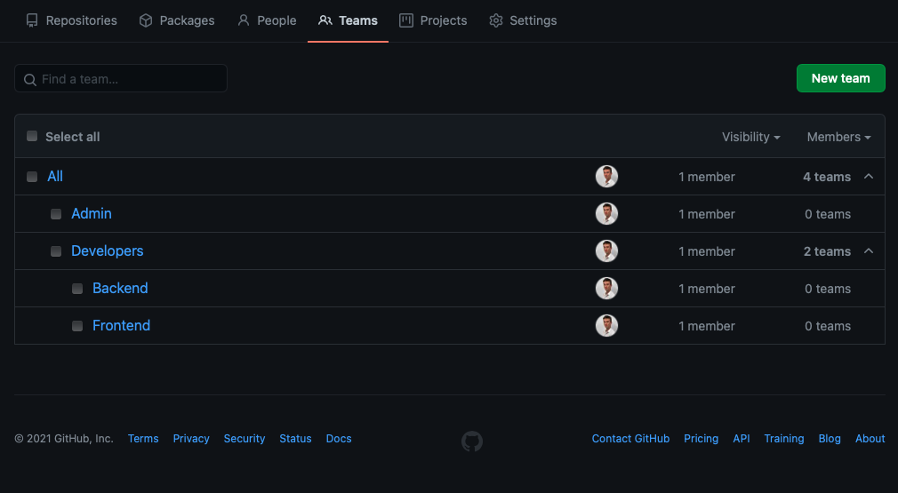
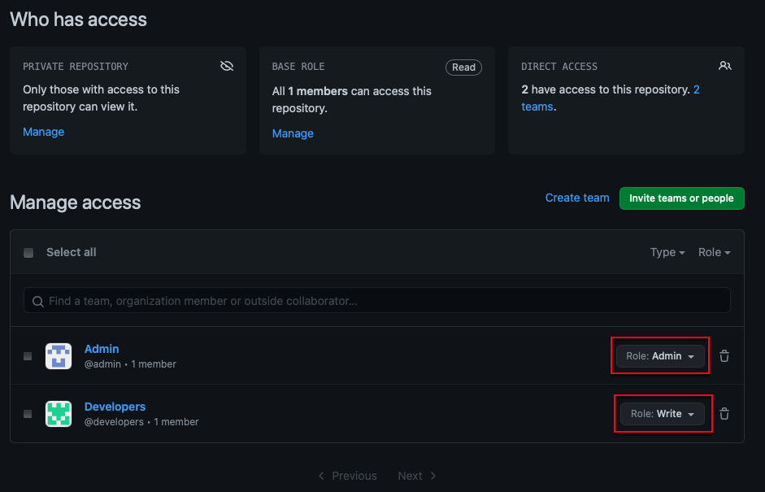

You can use teams within a repository to manage a whole group's permissions instead of setting permissions for each new member of the organisation.

See [Organizing members into teams](https://docs.github.com/en/github/setting-up-and-managing-organizations-and-teams/organizing-members-into-teams).

::: good

:::

Correctly configuring your organisation's teams structure will make it easy to give members the permissions level that they need. You can add teams to repositories to manage their roles.

::: good

:::

<!--endintro-->

Another benifit of using teams is that you can metion a whole team in a discussion instead of individual members. See [Mentioning people and teams](https://docs.github.com/en/github/writing-on-github/basic-writing-and-formatting-syntax#mentioning-people-and-teams)
