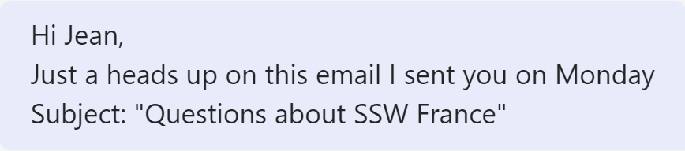

Usually, when mentioning an email in a Microsoft Teams chat, the approach is straightforward, such as typing "email subject: Good morning."

<!--endintro-->

To make your messages more visually appealing, you can use "> {{ MESSAGE }}" in Microsoft Teams chats to highlight your message as a quote. This works particularly well when you want to refer to an email subject, i.e:

::: bad  
  
:::

::: good  
  
:::

Try it now! Open a Microsoft Teams chat and type in “> This is an email subject” and press enter.
