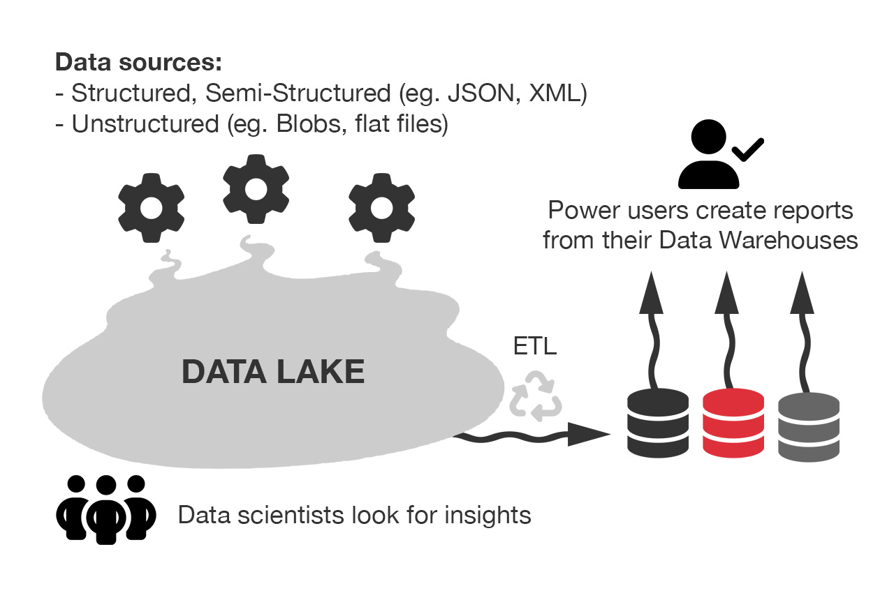

Databases, data warehouses, and data lakes are all essential components of Business Intelligence (BI) systems, but they serve different purposes and have distinct characteristics. Understanding their differences can help organizations make informed decisions about data storage and analysis.

<!--endintro-->

`youtube: https://www.youtube.com/embed/-bSkREem8dM`
**Video: Database vs Data Warehouse vs Data Lake | What is the Difference? (5 min)**

Basic (video above) - \[YouTube: Alex The Analyst] gives a good summary of the differences between the 3 types of data storage.

Advanced - \[YouTube: Seattle Data Guy] If you want to go a little deeper, take a look at the video [Databases Vs Data Warehouses Vs Data Lakes - What Is The Difference And Why Should You Care? (14 min)](https://www.youtube.com/watch?v=FxpRL0m9BcA) which goes into more detail.

## Databases

A database is a structured collection of data organized in a specific format, usually in tables with defined relationships between them. Databases are designed for transactional processing and are optimized for quick retrieval and updates of individual records. They excel at handling real-time, operational data and are commonly used for applications such as customer relationship management (CRM) or inventory management. Databases provide strong data consistency and enforce data integrity through predefined rules and constraints. However, they may have limited scalability for large volumes of data and may not be suitable for complex analytical queries.

## Data Warehouses

Data warehouses, on the other hand, are repositories that consolidate data from multiple sources into a centralized, structured format for reporting and analysis. They typically follow a dimensional model and provide a historical view of data, allowing organizations to analyze trends and make informed decisions. Data warehouses are optimized for complex queries and aggregations across large datasets. They provide a single source of truth and maintain data integrity through data cleansing and transformation processes. However, data warehouses are often designed with a predefined schema, which can make accommodating new data sources or changing business requirements more challenging.

## Data Lakes

Data lakes are vast repositories that store data in its raw and unprocessed form, without a predefined structure. They can store structured, semi-structured, and unstructured data, such as text files, images, or social media posts. Data lakes offer flexibility and scalability, allowing organizations to store massive amounts of data from various sources. They are suitable for exploratory analysis and data discovery since data can be transformed and processed as needed. However, data lakes can become a "data swamp" without proper governance and metadata management. The lack of structure and schema can lead to data quality issues and make it harder to extract meaningful insights without additional processing.

## Things to consider
* When building reporting solutions that read from the original data store, take care when deciding on the refresh schedule. You'll need to balance timeliness vs cost on the system being read from. If the refresh is very expensive, try and run it out of hours to avoid affecting the application's users.

* For small applications adding a read only replica of the main database is a much simpler and more cost effective alternative to a data warehouse. It avoids the reporting queries affecting the live database. It is typically cheaper than a data warehouse, a data-lake is often the cheapest solution infrastructure wise.
