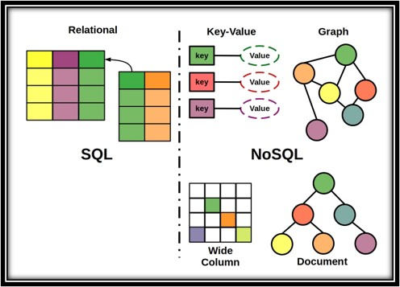

Almost every piece of software requires a database - even the humble *to-do app* needs somewhere to store those tasks. Data is the lifeblood of many businesses, and the underlying databases are often the piece of infrastructure that live longest. But are you taking the time to really think about which database is the best fit for the job?

<!--endintro-->

YouTube - **Alex The Analyst** gives a good summary of the differences between the main types of databases:

`youtube: https://www.youtube.com/watch?v=Pf-9pjJK1e0`
**Video: SQL vs NoSQL | What is the Difference? (5 min)**

### SQL databases

A relational database (often referred to as a SQL database) is a structured collection of data organized based on the principles of relational model theory. It consists of a set of interconnected tables, each representing a specific entity or concept. These tables contain rows (also known as records or tuples) that represent individual instances of the entity, and columns (also known as attributes or fields) that define the properties or characteristics of the entity. The relationships between tables are established through keys, which are used to link related data across multiple tables. The relational database management system (RDBMS) enables users to store, retrieve, and manipulate data efficiently using structured query language (SQL), providing a powerful and flexible solution for managing large volumes of data in a structured and organized manner.

#### ✅ Benefits

* **Data Integrity:** Relational databases enforce data integrity through various mechanisms such as primary keys, foreign keys, and constraints. These ensure that data is accurate, consistent, and reliable, preventing duplicate or inconsistent records.
* **Query Flexibility:** Relational databases offer a rich and powerful querying language called SQL (Structured Query Language). SQL allows users to perform complex queries, aggregations, sorting, and filtering operations on the data. This flexibility enables users to retrieve information efficiently and derive valuable insights from the data.
* **Scalability and Performance:** Relational databases are designed to handle large volumes of data and can scale vertically (by adding more powerful hardware) or horizontally (by distributing data across multiple servers). With proper indexing and optimization techniques, relational databases can deliver high-performance query execution even with extensive data sets.

#### ❌ Challenges

* **Fixed Schema:** Relational databases require a predefined schema that defines the structure and relationships of tables. Once the schema is set, it can be challenging to modify it without affecting existing data or applications. This lack of flexibility can be a limitation when dealing with rapidly evolving or unstructured data.
* **Performance Overhead:** Relational databases impose certain overhead due to their complex architecture and features. Joining multiple tables, enforcing constraints, and maintaining data integrity can sometimes impact performance, especially when dealing with complex queries or high transaction volumes.
* **Scaling Limitations:** While relational databases can scale horizontally by distributing data across multiple servers, there are practical limits to their scalability. As the data volume and transaction load increase significantly, scaling a relational database can become challenging and may require additional architectural considerations or specialized technologies.

### NoSQL databases

A NoSQL (Not Only SQL) database is a non-relational database that provides a flexible and scalable approach to storing and managing data. Unlike traditional relational databases, NoSQL databases do not rely on fixed schemas and tabular structures. Instead, they use various data models, such as key-value, document, columnar, or graph, to organize and store data based on specific requirements. NoSQL databases are designed to handle large amounts of unstructured or semi-structured data and can scale horizontally by distributing data across multiple nodes or servers. They offer high performance and flexibility, allowing for agile development and easy scalability. However, NoSQL databases may sacrifice certain features of relational databases, such as strict data consistency or complex querying capabilities, in favor of improved scalability and performance in certain use cases.

Some of the main flavours of NoSQL databases are:

* Document
* KeyValue
* Blob
* Graph

#### ✅ Benefits

* **Scalability and Flexibility:** NoSQL databases excel in handling large-scale and distributed data. They provide horizontal scalability by allowing data to be distributed across multiple servers or nodes, which enables efficient handling of high volumes of data and high traffic loads. Additionally, NoSQL databases offer flexibility in terms of data model and schema, allowing for easy adaptation to evolving data structures and requirements.
* **High Performance:** NoSQL databases are optimized for performance and can handle massive amounts of data with fast read and write operations. They are designed to achieve high throughput and low latency, making them suitable for use cases that demand real-time data processing, such as web applications, IoT, and streaming platforms.
* **Schemaless Nature:** Unlike relational databases that enforce rigid schemas, NoSQL databases are schemaless or have a flexible schema. This means that data can be stored without a predefined structure, allowing for easy handling of unstructured or semi-structured data. The absence of a fixed schema provides agility in development and allows for faster iteration and adaptation to changing data requirements.

#### ❌ Challenges

* **Limited Querying Capabilities:** NoSQL databases typically offer limited querying capabilities compared to relational databases. They may lack complex join operations or the ability to perform ad-hoc queries efficiently. This can be a drawback when dealing with complex data relationships or when a wide range of query types is required.
* **Data Consistency:** NoSQL databases often prioritize scalability and performance over strict data consistency. In certain NoSQL models, such as eventual consistency, there might be a delay in propagating changes across all replicas, which can result in data inconsistencies in distributed systems. Ensuring data consistency in NoSQL databases may require additional application-level logic or trade-offs in terms of availability or performance.
* **Learning Curve and Tooling:** NoSQL databases often have a learning curve associated with their specific data models and query languages. Developers and administrators may need to learn new concepts and tools to effectively work with NoSQL databases. Additionally, the tooling and ecosystem around NoSQL databases may not be as mature or widely adopted as those for relational databases, which can impact development and operational processes.
