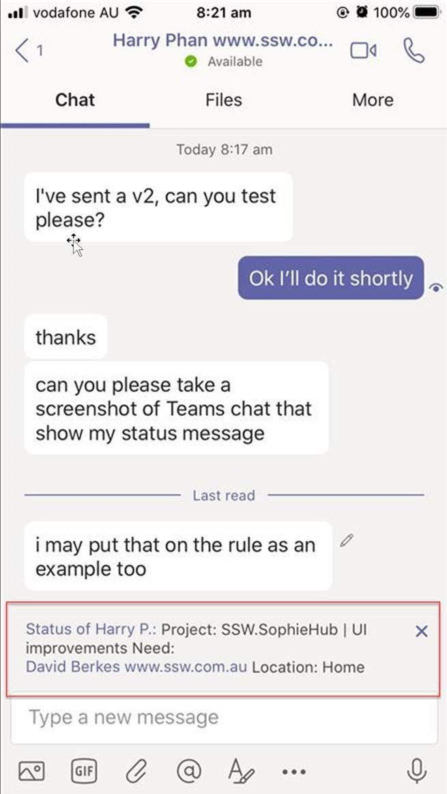
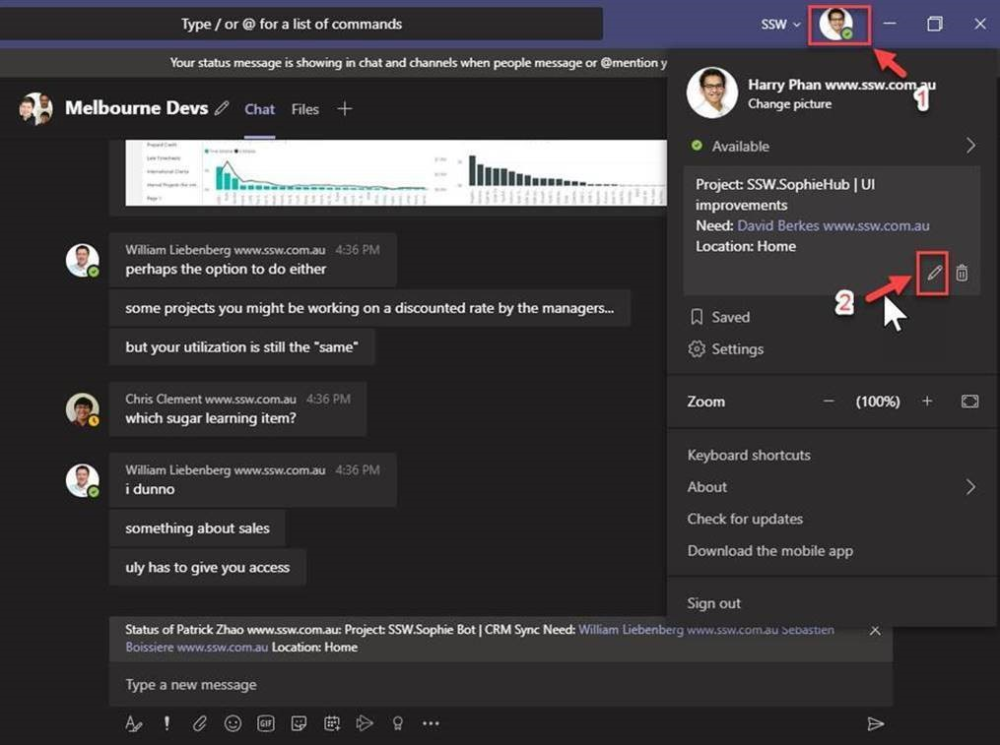
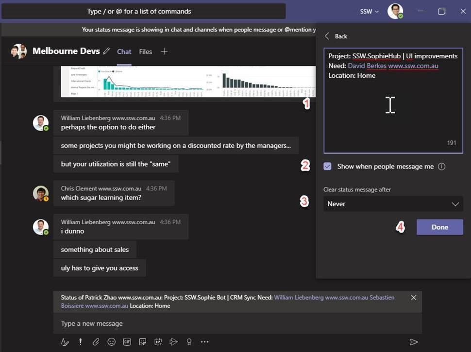

​The status message is often not used but can be quite helpful. People can instantly see what you are up to when they chat with you. ​​ 

It tells people 3 things:​ 
<ul><li>What project you’re working on</li><li>The people that you need to speak to (they will get the notifications)</li><li>The location of where you are​</li></ul>
 <excerpt class='endintro'></excerpt> 
<dl class="image"><dt>
      ​</dt><dd>Figure: When people chat with you, they can see what you’re up to</dd></dl><h3 class="ssw15-rteElement-H3">More information​ </h3>
To update the status message, follow these steps:​​​ 
<ul><li>On the top right, click on your photo</li><li>Click on the pencil icon to edit the status message​ </li></ul><dl class="image"><dt>
      
   </dt><dd>Figure: Edit the Teams status message each day</dd></dl>
The status message is helpful when it contains: ​ 
<ul><li> 
      <b>Project:</b> xxx (the product/project you’re working on) | yyy (the tasks you’re working on)</li><li> 
      <b>Need: </b>xxx (team members that you’re working with – use @mention to tag these members)</li><li> 
      <b>Location:</b> xxx (where you’re working from e.g. Home, SSW Melbourne, CBA, etc.) </li></ul> 
<b>Note: </b>the benefit of using the field names with the colon is that it allows you to programmatically extract the information e.g. on SSW SophieBot when you ask who is Patrick, you could also see this information and query why the location field is different from the Wifi he is connected to.  
<ul><li>Enable “Show when people message me”</li><li>For “Clear status message after”, select Never (to prevent Microsoft from deleting the status message)</li><li>Click Done once complete </li></ul><dl class="image"><dt>
      
   </dt><dd>Figure: Edit the status message​</dd></dl><h3>Related rule</h3><ul><li><a href=/methodology-do-you-do-daily-scrums-aka-stand-up-meetings>Do you do Daily Scrums (aka stand-up meetings)?​</a> </li></ul>

