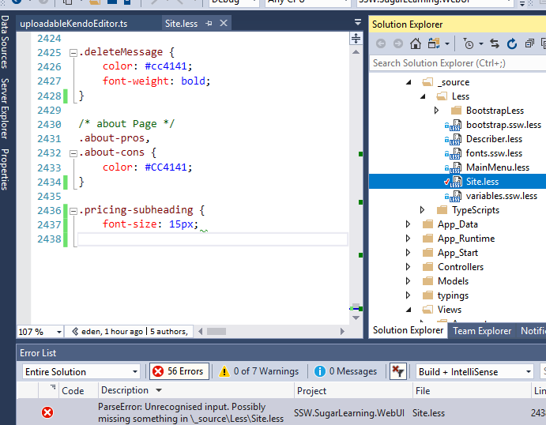

You can use Visual Studio's Web Compiler extension to create a bundle.css and test if CSS was compiled successfully.

<!--endintro-->

More information and download at [Visual Studio Marketplace](https://marketplace.visualstudio.com/items?itemName=MadsKristensen.WebCompiler).

::: good  
  
:::
Unfortunately different kinds of errors, like are not caught.

::: bad  
  
:::

In addition, Gulp is wrongly successful too:

::: bad  
  
:::
