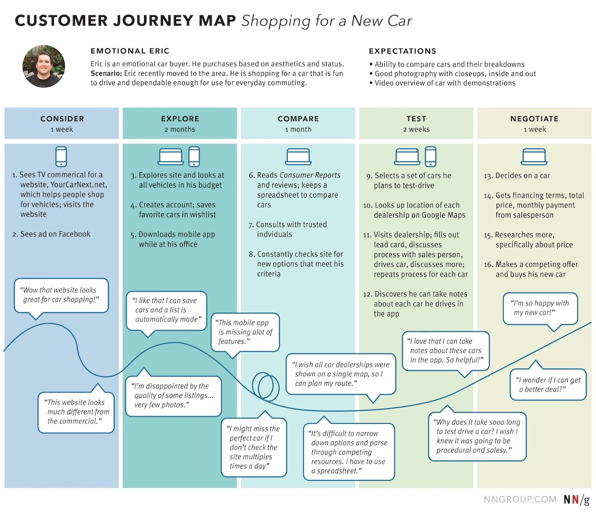
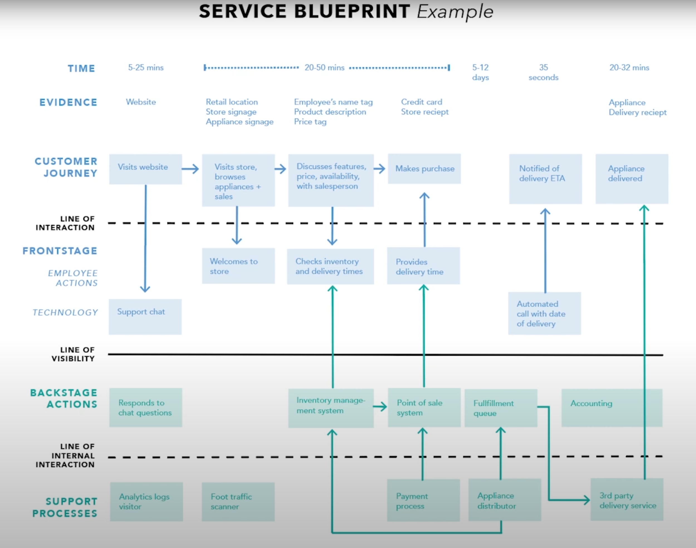

A User Journey Map (aka Customer Journey) is a visual aid that allows the clear communication of user needs.

`youtube: https://www.youtube.com/embed/jIAFVNz2jdc`
**Video: What is User Journey Mapping? (7 min)**

<!--endintro-->

These artifacts should be used at the beginning of a project during the early stages of research and design. This allows user requirements to properly inform design decisions made during development, and can help teams build a strong common understanding of a project. Capturing feedback in a Journey Map during or even after development, can provide high value as well. Pain points discovered in this way can reveal opportunities or areas for immediate improvement. 

## What is a User Journey Map

[Source: nngroup](https://www.nngroup.com/articles/analyze-customer-journey-map/)

User Journey Maps are used to understand how a customer interacts with your product or services. There are many ways of presenting this information. Take a look at [Smaply's example Journey Maps](https://www.smaply.com/blog/example-journey-maps). 

The key things captured in a User Journey Map are what steps/stages the customer goes through and also some indication of user sentiment at the time. Often the user journey will be mapped out and then research done to gauge user sentiment at each point in the journey.

This can be done using wireframes or mockups rather than going through the entire build of the software. This way any potential pain-points for users can be identified and improved before going through the costly exercise of developing software.

They are also used in follow up research to identify problems in existing software and systems. This is especially true in sales processes, where it is very easy to identify where user drop off occurs.

## Service Blueprints

Sometimes the coding starts too early and, on some projects, the Product Owner needs more help to visualize what's being proposed. A great way to get in sync is to use Service Blueprints.

[Source: nngroup](https://www.nngroup.com/articles/analyze-customer-journey-map/)

A Service Blueprint is a more detailed and process oriented document. This covers the steps from the User Journey Map and clearly details where and how the user journey will interact with the system being built. It also captures the various processes required inside the software. Often it will allow almost all API interactions to be captured, making it much easier for the developers to understand exactly what the various parts of the system are intended to do and what the user might be doing when they are called.

## When to use them

Both these types of diagrams provide excellent documentation that is easily digestible, even by non technical people. They are especially valuable to verify with the Product Owner and to help the team understand the product vision. Because the Product Owner can easily understand what is happening, they can provide much better feedback than if they were simply provided UI wireframes or traditional documentation. 

**The team should produce these artifacts, typically not the Product Owner - this ensures what was in the Product Owner's head has made it to the team.**

## User journey mapping tools

* [FigJam](https://www.figma.com/figjam/) 
* [Miro](https://miro.com/index/) 
* A whiteboard and a stack of sticky notes.
