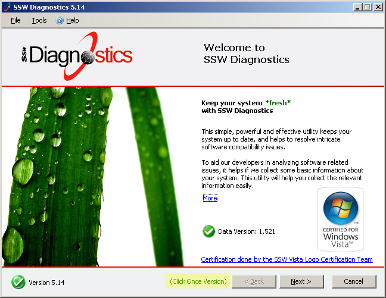
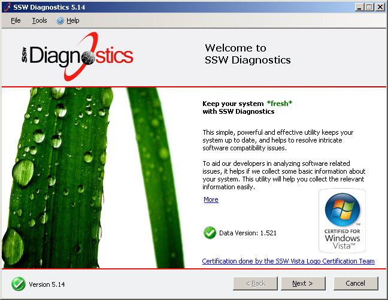

If you use ClickOnce to deploy your application, you should clearly show a symbol indicating this is a ClickOnce version application. ClickOnce makes applications enjoying convenient update, maximising to keep the safety of the users' system environment.

<!--endintro-->
::: good

:::

::: bad

:::
