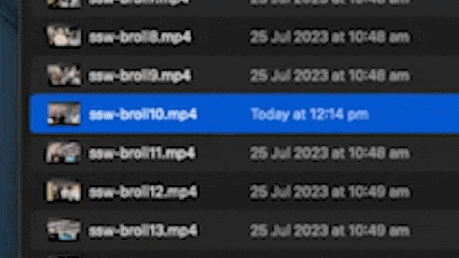
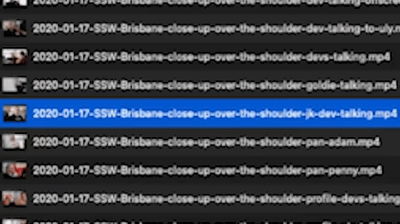
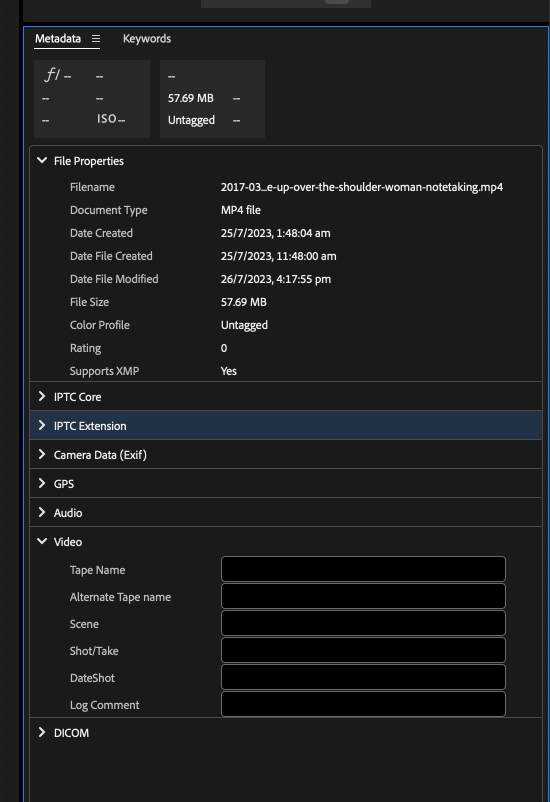
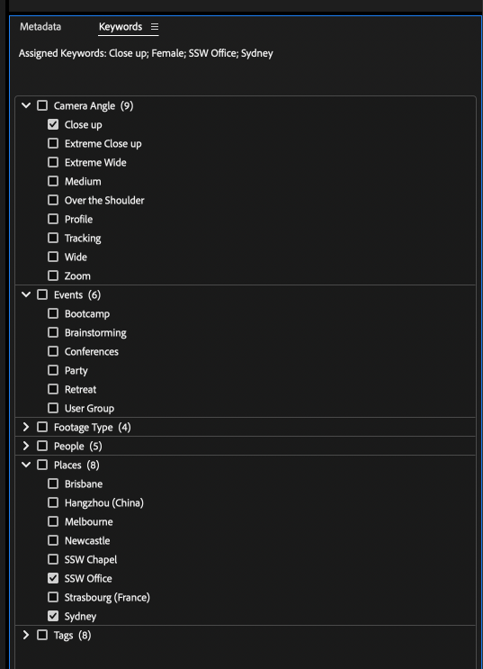
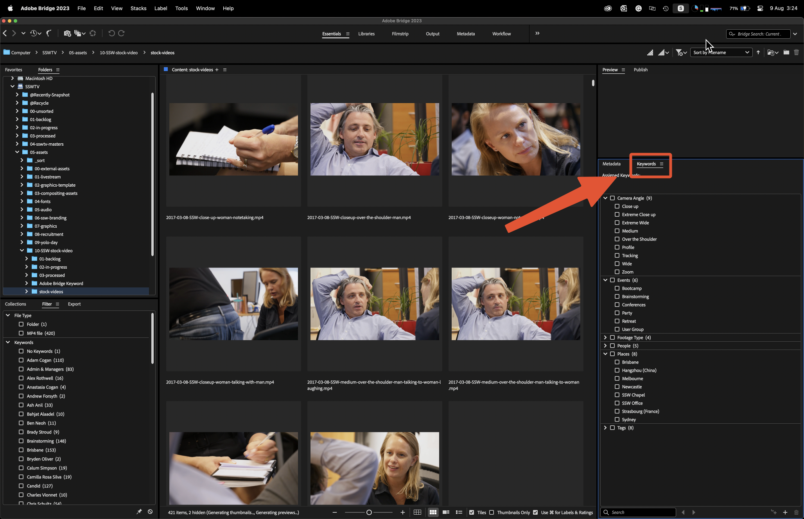
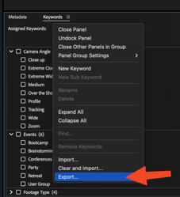
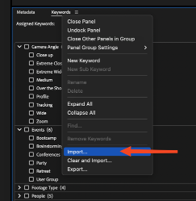

Trying to manage your large library of digital files can be pretty difficult using just Windows File Explorer or Mac's Finder as you are limited to folder structure and file names, which can lead to lost and abandoned assets due to ridged search functionality. When trying to preview your assets, your operating system may also lack support for previewing proprietary formats (E.g. Fujifilm's .RAF or Nikon's .NEF). A good **Digital Asset Manager (DAM)** like Adobe Bridge solves this.

While there are several digital asset managers on the market, each with its strengths and weaknesses, for the majority of small teams, independent creatives and the budget-conscious, Adobe Bridge is more than enough to handle the task.

## Why do you need a stock library?

When video editing, you might need a certain shot that was not captured on production due to oversite or budget constrictions. That is why editors turn to stock footage libraries like the following:

* [filmsupply.com](https://www.filmsupply.com)
* [storyblocks.com](https://www.storyblocks.com)
* [artlist.io](https://artlist.io)
* [stock.adobe.com](https://stock.adobe.com)
* [motionarray.com](https://motionarray.com)
* [elements.envato.com](https://elements.envato.com)
* [pixabay.com](https://pixabay.com)
* [pexels.com](https://www.pexels.com)

While stock footage sites are great for getting high-quality footage for your project, they lack the personal touch of your company or brand. That is why it is important to build your own internal stock library. While this does add extra effort to each project you shoot to build your library, the benefits of doing so include:

* Branding awareness - Having footage that includes your logos
* Culture - Showing off the people that work with you
* Ownership - Copyright ownership of the footage

## How to get started with creating your stock library

1. You should open a new timeline and drop all the [B-Roll](/video-editing-terms/#4-b-roll-footage) clips that you have collected into that timeline.
2. Then cut out the unusable footage from the head and tail of each clip.
3. Break up footage if needed, into smaller clips or different takes.
4. Make colour corrections if needed.
5. Name each clip with a name that references where the footage is from, what the shot type is, and a unique identifying number.
6. Finally export each clip individually to your stock library.

::: bad

:::

::: good

:::

From there you can use a digital asset manager like Adobe Bridge to add further metadata information to help with navigating your personal stock footage library.

## What is Adobe Bridge?

Adobe Bridge is a creative digital asset manager that lets you preview, organize, edit, and publish multiple creative assets (including Adobe Photoshop, InDesign, Illustrator, After Effects, and Dimension files) with thumbnails and rich previews. Edit metadata. Add keywords, labels, and ratings to assets. Organize assets using collections, and find assets using powerful filters and advanced metadata search features.

## Organize your media files

By creating a well-structured folder hierarchy and sticking to a standard naming convention, we can make sure media assets won't get accidentally deleted or go missing.
Consider organizing videos based on projects, clients, or types of footage (E.g., interviews, B-roll, aerial shots).

## Utilize metadata

Leverage the power of metadata with tags and or keywords and enhance searchability. In Adobe Bridge you can provide additional information about your media asset. Add relevant details such as project name, shoot location, keywords, and descriptions to your file, doing so will make it significantly easier to search for specific videos and streamline your workflow.

## Importing and Exporting Keywords for team collaboration

Although Adobe Bridge is made without multi-user support. With a workaround, It is still possible to use this program in a small team, this is made possible due to the ability for keywords to be written onto each file directly. So as long as your team uses a shared keywords list, searching your media library should be simple.
You can do this by importing and exporting keywords .XML file for your team to use.

1. First Navigate to the Keywords tab and right-click the tab to open the dropdown menu.

   

2. Next, click on export to export your current keyword list.

   

3. Save this file with a version number to a shared folder accessible to everyone in your team.
4. To import an existing keyword list, navigate and click on import from the same list. Then select the .XML file you want to import.

   
