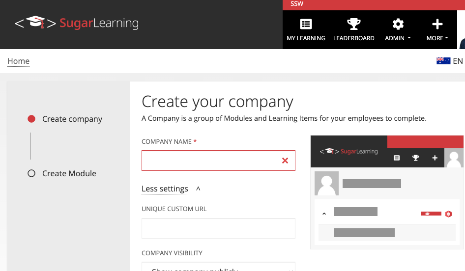
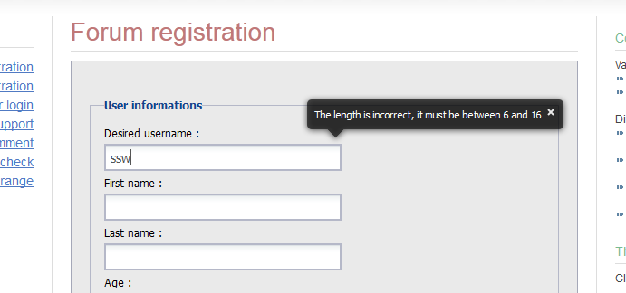

Most fields require validation. There are three types of validation:

* Required Field - the field should be filled in.
* Formatting - the field must be in a correct format, e.g. currency or date.
* Logical - the field needs to pass some validation tests in the business layer.

<!--endintro-->

To show an error, display an error provider icon next to the field on the right. An example of this is shown in the figure below.

* Validation must not be done on TextChanged, as this may chew the processor if it is a logical validation. It can also give unpleasant results, e.g. when entering -6.00, as soon as the '-' is entered the validation control would turn on.
* Validation for Required fields must be done in the validating event.
* Validation for format should be done in parse/format methods.
* Validation for Logic should be done in Validated, since it must be entered if required and be in correct format.

The reason for the above validation placement is that these events run in the following order:

* Validating
* Parse/Format
* Validated

::: good

:::

Do **not** show a message box after every error in validation. You may show a message box as an error summary when an OK or Apply is clicked. Make sure you warn the user that there is an error on the form when they attempt to save.

::: good

:::

::: info
**Note:** For validation errors, don't rely on an error message box and instead automatically focus on the control with the validation error (e.g. in WinForms, use SetFocusOnError on controls that fail validation).
:::
