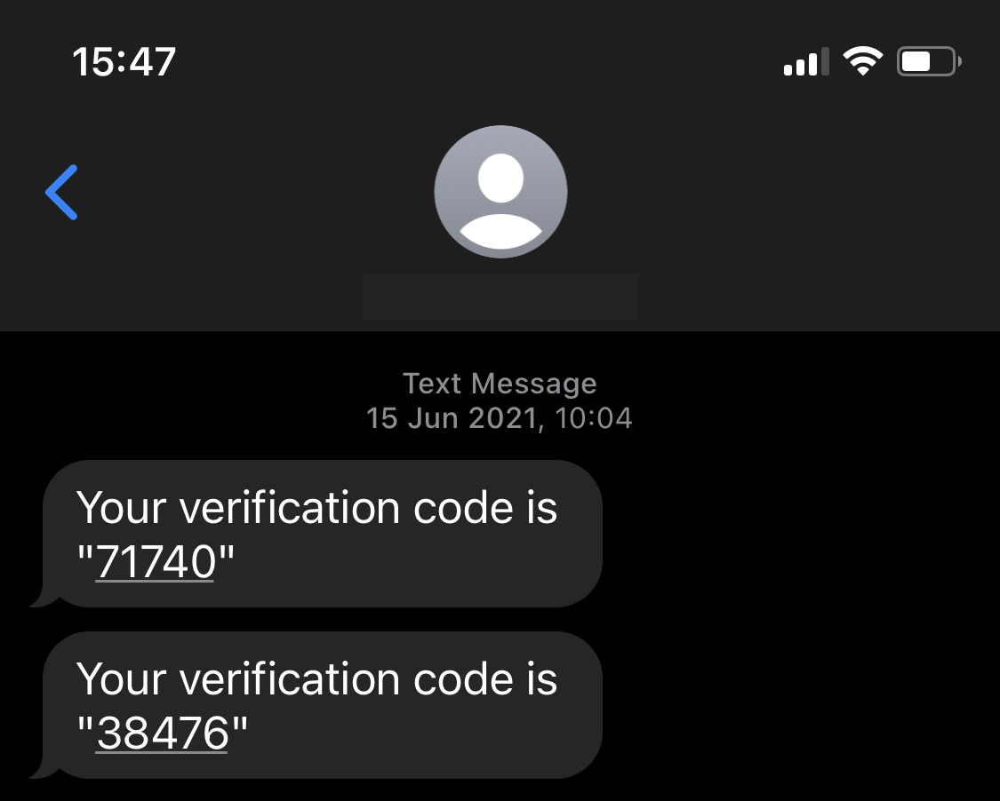
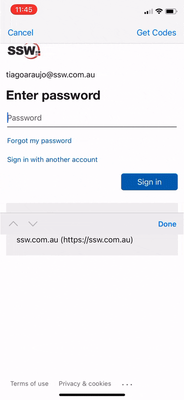
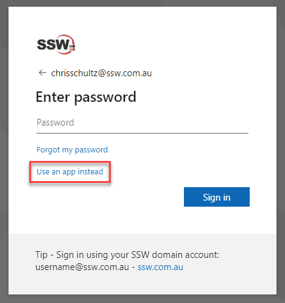
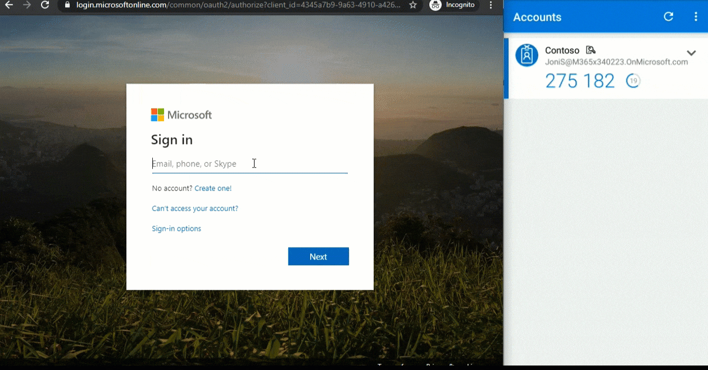
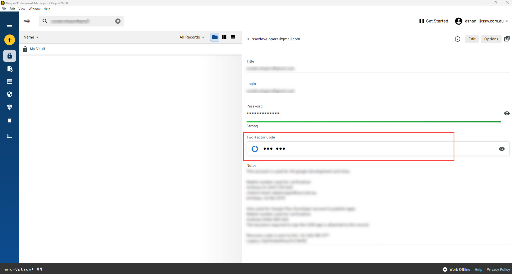

The best protection you can provide for your password is to not solely rely on it. Multi-factor authentication (MFA) lets you use a mix of techniques when logging into an account. Typically this is made up of something you know (your password) and something you have (your phone - older people will remember RSA tokens).

<!--endintro-->

Your phone can provide a second factor either through an installed authenticator app, or by receiving an SMS with a one-time password. Authenticator apps are recommended, as they are more secure than SMS.

We are now seeing biometric security using facial recognition, fingerprints, or in more advanced scenarios palm-vein scanning (and plenty of others too). While biometrics offer convenience and reduce our reliance on passwords, they usually replace username and password altogether (although rely on accounts that use them behind the scenes), rather than providing an additional factor (e.g., username + password + fingerprint).

Nearly any service you use now will support MFA, either through an authenticator app, SMS, call or even email if you have no other option. **Ensure that it is enabled for everything you use.**

::: ok

:::

### Passwordless sign-in

If you use the Microsoft Authenticator app, you can go one step further and get rid of the need to type a password. To enable passwordless sign-in:

1. Open the Authenticator app, and tap on the account you want to enable it for
2. Tap Enable phone sign-in and tap Continue

Now that it is enabled, you will need to change your default - next time you need to sign in:

1. Instead of typing your password, select **Use an app instead** or **Other ways to sign in**
2. Select **Approve a request on my Microsoft Authenticator app**

:::greybox
**Note:** The above option "Use an app instead" takes some time to reflect on your login prompt after you have made changes in your Authenticator App.
:::

See [detailed instructions from Microsoft](https://support.microsoft.com/en-us/account-billing/sign-in-to-your-accounts-using-the-microsoft-authenticator-app-582bdc07-4566-4c97-a7aa-56058122714c).

::: good

:::

### Use 2FA in Keeper

[Keeper](https://www.keepersecurity.com) is a password manager which has an awesome feature inbuilt to store our MFA codes. Keeper has developed a fully-integrated security layer that adds two-factor codes directly to vault records. 

Keeper works as a password entry authenticator with support for Google Authenticator, Microsoft Authenticator, and other Authenticator apps. To set up this integration, go to your password entry and click the Add Two-Factor Code button under the Custom Fields and File or Photo options. You can then upload a QR code or manually set up a connection to your account to authenticate via a time-based one-time password app. 

::: good

:::
