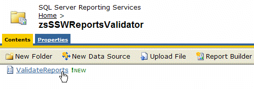
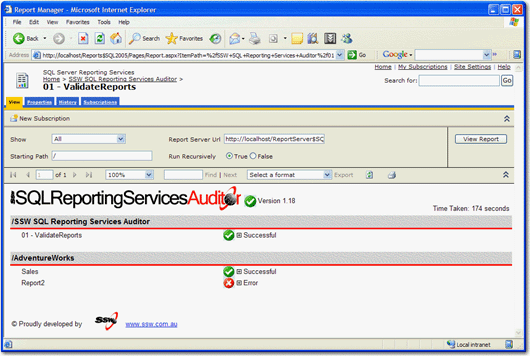

Reporting Services does not have a build button, and thus, there is no way to verify that every single report is error free.
Every Reporting Services installation should include this validator to check that all the reports are good.

<!--endintro-->

SSW SQL Reporting Services Auditor is Web-Application that iterates through all the reports on a report server and shows whether they have rendered correctly or if any errors occurred.

The SSW SQL Reporting Services Auditor web application returns an XML dataset that can be consumed natively by SQL 2005 Reporting Services. The XML dataset can also be consumed by SQL 2000 Reporting Services; however, this requires you to write a custom Data Processing Extension as SQL 2000 Reporting Services does not natively support XML data sources.
For more information read Microsoft's guide on [Using an External Dataset with SQL 2000 Reporting Services](https://learn.microsoft.com/en-us/sql/reporting-services/extensions/data-processing/using-an-external-dataset-with-reporting-services?WT.mc_id=DP-MVP-33518).

Download [SSW SQL Reporting Services Auditor](https://www.ssw.com.au/archive/sql-reporting-services-auditor/user-guide.html) (Requires SQL Server 2005 Reporting Services).
