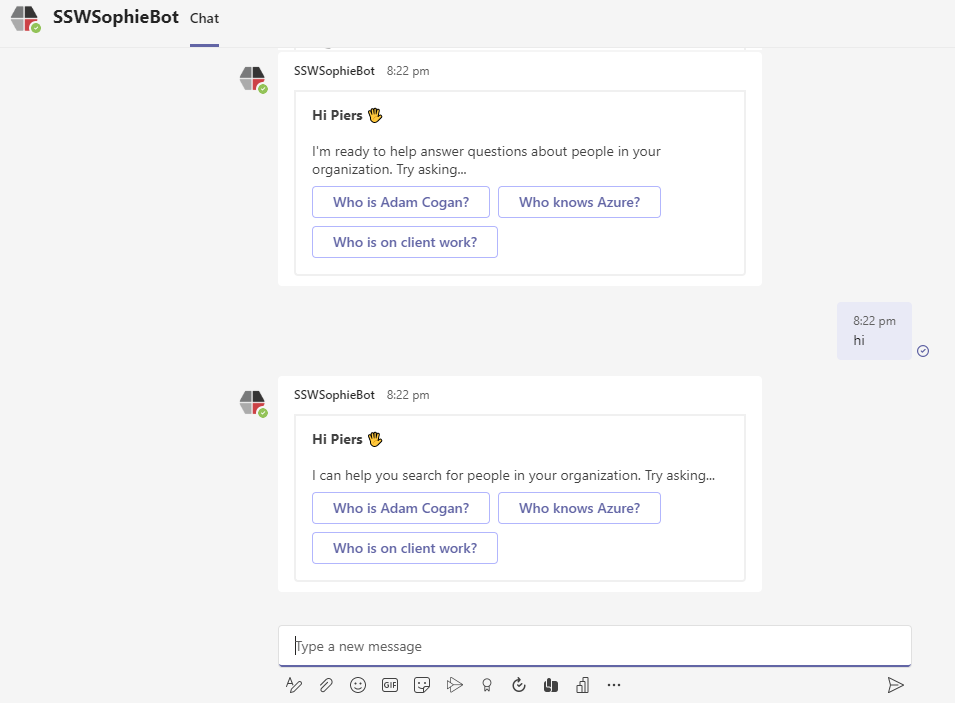

People don’t act like robots and answer the same way all the time. Neither should bots!  All you need is a few different welcome messages and use a rand() function.

<!--endintro-->

::: good

\
:::