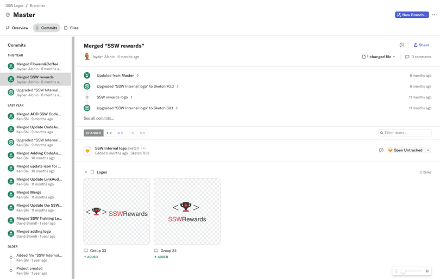
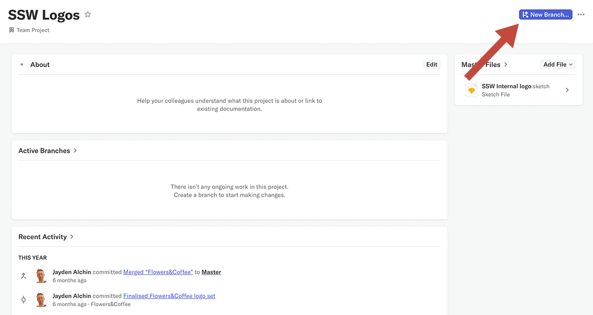
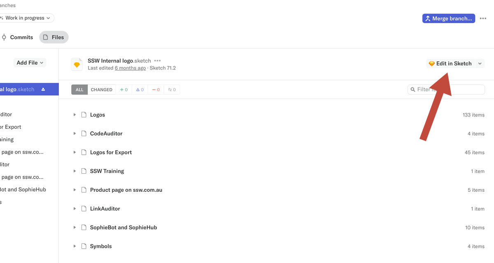
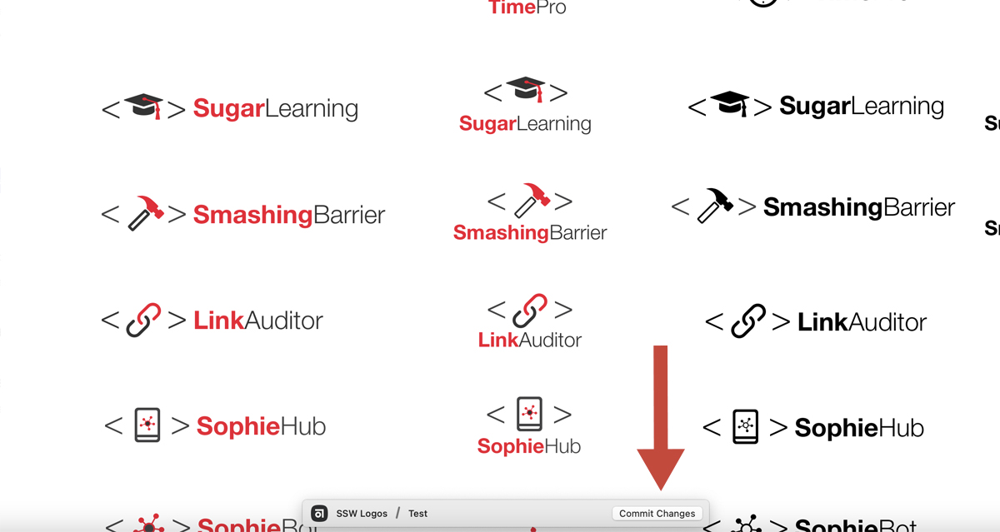
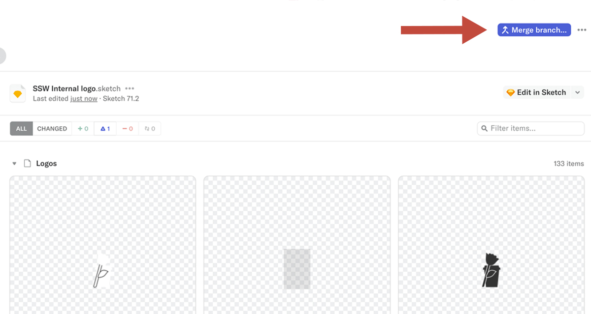

When it comes to design work, **Abstract** is considered the best tool for sharing and version control over GitHub and other similar tools because 
it displays changes visually. It easily synergises with Sketch and Zeplin to form a useful software ecosystem and streamlined workflow for designers. 
The result is a system that allows designers to collaborate without overwriting each other’s work while easily tracking the changes made. 

<!--endintro-->

::: greybox  
Warning: Abstract is available only on MacOS
:::

Using Abstract version control makes it easy for designers to work together, clearly displays which version of a project is the latest and 
shows who has created or edited elements.

Follow these steps to contribute to a project in Abstract: 

1.	Open a project in Abstract 
2.	Create a new branch and give that branch a name that reflects the work you’re doing.

3.	Click “Edit in Sketch”.

4.	Make and save your changes in Sketch. 
5.	Commit your changes to Abstract.

6. When you're all done, merge your branch.

::: greybox  
Warning: While you can open a Sketch file by selecting “Open Untracked”, this will not save your changes in Abstract - meaning you won’t be able to collaborate with others and your changes could be lost.
:::
