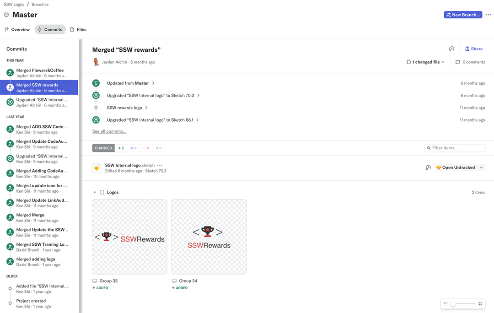

When it comes to design work, **Abstract** is considered the best tool for sharing and version control over GitHub and other similar tools because 
it displays changes visually. It easily synergises with Sketch and Zeplin to form a useful software ecosystem and streamlined workflow for designers. 
The result is a system that allows designers to collaborate without overwriting each other’s work while easily tracking the changes made. 

<!--endintro-->

::: greybox  
<mark>Warning:</mark> Abstract is available only on MacOS
:::

Using Abstract version control makes it easy for designers to work together, clearly displays which version of a project is the latest and 
shows who has created or edited elements.
