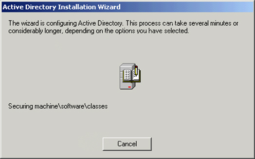
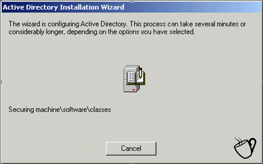

If you are unable to show a progress bar, you should still indicate that it may take be a long process. For example, if installation takes more than 5 minutes, let your users know so they can get on with something else:

 <excerpt class='endintro'></excerpt> 
​<dl class="badImage"><dt></dt>
<dd>Figure: Bad example - An unknown length of time. So let them know</dd></dl>
<dl class="goodImage"><dt></dt>
<dd>Figure: Good example – The coffee cup tells the user that they will be here a while</dd></dl>

