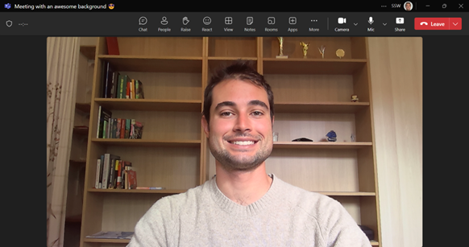

You are likely to have constant Teams or Zoom video calls with clients or work colleagues. One of the first things you should think about should be how to have a nice background.

<!--endintro-->

When in the office, you can have a nice branded background, which is the best option. 

For home offices, follow "less is more":

* Try to have a neutral wall or setup behind you or with minimal objects – that will cause less distraction for others when talking to you.\
  In other words, you may be fond of family pictures or band posters hanging on the wall, but the person on the other side may find them distracting
* Also watch out if you have a pile of clothes to fold, boxes, or any mess that may be behind your desk
* A nice test is to sit at your desk and to take a selfie to see what others will see in your background. Then organize your background accordingly
* Watch for the lights as they can improve the general quality of your video
* If you want to go the extra mile, consider designating one wall as your company wall and keep it consistent with the company branding

::: bad

:::

::: ok

:::

::: good

:::

### Virtual backgrounds

Not ideal, but if you can't have a nice and clean background, the alternative is to use the virtual background effect feature (e.g. Blur OR a background image):

* **Teams** - [Custom backgrounds in Microsoft Teams make video meetings more fun, comfortable, and personal](https://www.microsoft.com/en-us/microsoft-365/blog/2020/06/12/custom-backgrounds-microsoft-teams-video-meetings-fun-comfortable-personal/)
* **Zoom** - [Virtual Background](https://support.zoom.us/hc/en-us/articles/210707503-Virtual-Background)
