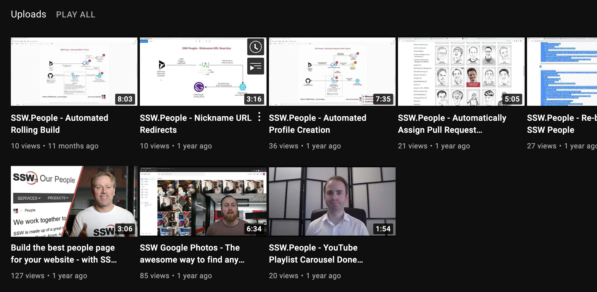
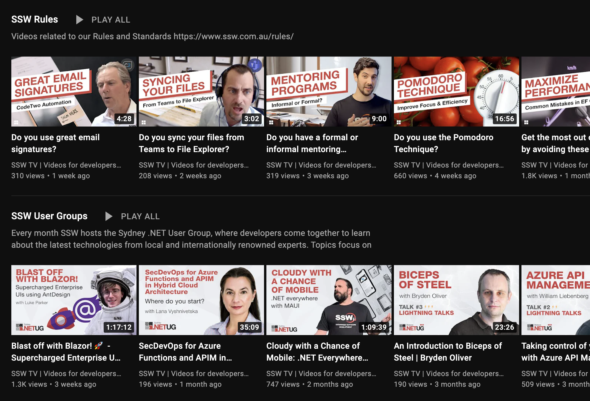

Thumbnails are a great way of telling your (potential) viewers what your video is about and why they should watch it. It is therefore important that these stand out from the others.

<!--endintro-->

A thumbnail can draw attention by:

* Using bright colors and avoiding using the YouTube colors (white, black, red) so you don’t blend in
* Being custom ([90% of the best performing videos on YouTube have custom thumbnails](https://creatoracademy.youtube.com/page/lesson/thumbnails#strategies-zippy-link-2))
* Using big bold titles (30 characters maximum, remember a thumbnail is small)
* Feature your main keyword in the title

YouTube offers [resources to create better custom thumbnails](https://support.google.com/youtube/answer/72431?hl=en) including image size and resolution, policies, etc.

### Creating a visual identity

Establishing a unique visual style for thumbnails is great for grouping similar videos together and encouraging click-throughs. This has the added benefit of increasing brand recognition and strengthening the connection between grouped content.

::: bad

:::

::: good

:::
