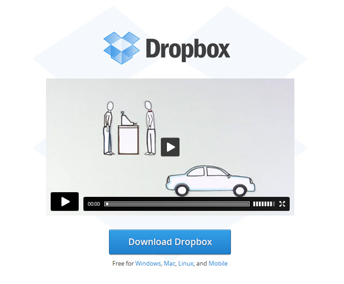

The best way to show the features of a product is creating a video. The information you are able to communicate in seconds of a video would take hundreds of words of text to explain. 

Videos are also important for services, but for products, it should be <strong style="font-size:1em;">on the homepage</strong>.

 <excerpt class='endintro'></excerpt> 
<dl class="goodImage"><dt></dt><dd><a href="https://www.dropbox.com/" target="_blank">Good Example - Dropbox homepage</a> has no text but a video that shows nicely how it works </dd></dl><h3 class="ssw15-rteElement-H3">Videos are also good for SEO</h3>
By embedding videos onto your website it will help get the videos more views, which is a determinant for Google nowadays.

