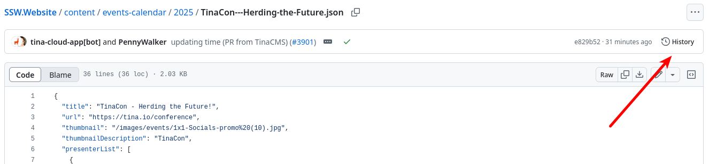

If you find a mistake in a file hosted on GitHub, don’t just fix it blindly - check who made the change and why. This helps you understand the context and gives you the chance to inform the contributor if a correction is needed.

GitHub makes it easy to view a file's version history, compare changes, and even see discussions around each commit.

<!--endintro-->

## Viewing changes to a file in GitHub

1. Navigate to the file in the repository on GitHub

   
2. Click on the "History" button (clock icon) at the top right of the file view. You’ll see a list of commits that modified this file

   
3. Click on a commit to view the **diff** - the [changes between two file versions](https://docs.github.com/en/pull-requests/committing-changes-to-your-project/viewing-and-comparing-commits/differences-between-commit-views), showing what was added, deleted, or changed

   
   


:::info
If you're working locally, you can also run the following commands to view the exact changes within the terminal.

```shell
git log -- path/to/file
git show <commit-hash>
```
:::
