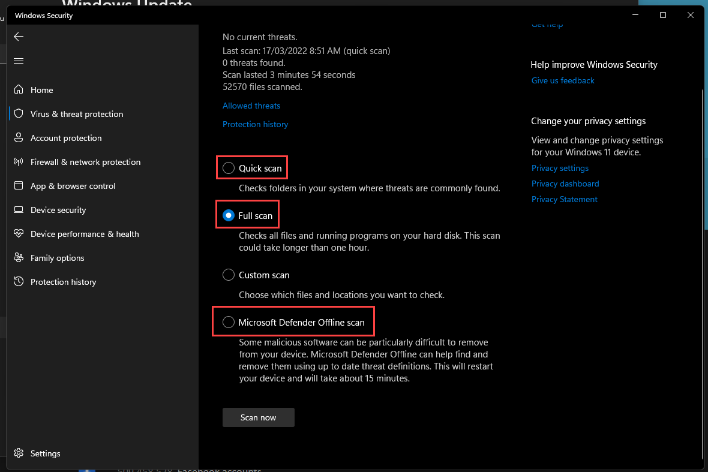

Users are often exposed to viruses on their machines. Virus scans help identify and remove potential threats on your machine. Windows comes with built-in protection called **virus and threat protection** that is suitable for most situations.

<!--endintro-->

Make sure to regularly run a quick scan on your computer to check for vulnerabilities. These quick scans don't take long and make sure the most common threats are addressed.

If it is suspected that a machine has a virus, then it pays to be extra certain about possible infections. In that case, do the following:

1. Run a quick scan - This scan will quickly identify and isolate threats
2. Run a full scan - This scan takes a few hours and will do a deep check on your PC to remove problems
3. Once you don't need to use your PC, run an offline scan - This scan will take your PC offline to do a scan and ensures viruses can't reinfect you during the quarantine process

