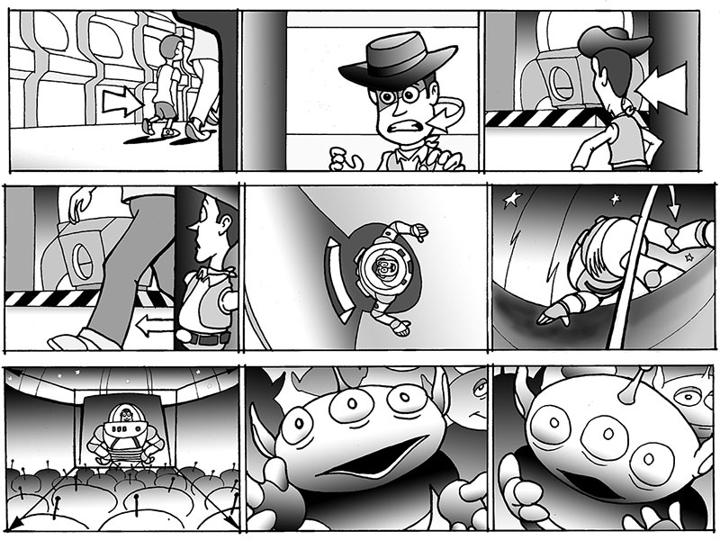
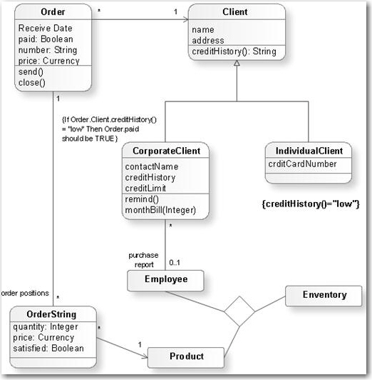

Storytelling plays a large role in software design and development. A story captures attention, provides clarity, and inspires teams and stakeholders to take action. 

Storyboards is a good ways to visually communicate stories to teams and stakeholders.
A storyboard is composed of a linear sequence of graphics or illustrations combined to create a visual story.

Used as a tool, storyboards first became popular in motion picture production.

::: good

:::

In the world of software development, storyboards is used to provide additional context to teams and stakeholders. Using images makes the story quick to understand at first glance and easy to remember.

<!--endintro-->

### Elements of a storyboard

There are 3 common storyboard elements: a user story, visuals, and corresponding captions.

**User story:** Storyboards are based on a specific scenario. The role that corresponds to that scenario must be clearly specified. A short text description of the scenario or story must clear enough that a team member or stakeholder could understand what is depicted before looking at the visuals.

Also See: [Do you use User Stories format when appropriate?](https://www.ssw.com.au/rules/spec-do-you-use-user-stories/)

**Visuals:** The scenario is visually depicted in a sequential manner using sketches or photos. These images can range from quick, low-fidelity drawings to detailed, high-fidelity artifacts, depending on the purpose and intended audience of the storyboard. The visuals include relevant details such as the user’s environment or a sketch of the screen being interacted with.

Also See: [Do you know the value of User Journey Mapping?](https://www.ssw.com.au/rules/user-journey-mapping/)

**Captions:** Each visual should include corresponding s to describes the user’s actions, environment, device, and so on.

::: good

:::

::: bad

:::

### How to create a storyboard
Creating a storyboard can feel like a daunting task. However, remember they are most valuable as a low-fidelity artifact and don’t need to take a long time to create.

Effective storyboarding follows 6 key high-level steps:

**1.Define the purpose:** 

It's important to have a clear goal before creating the storyboard. 

Having a clearly-defined goal will enable you to determine the scenario and user persona your storyboard will focus on, as well as who should be involved in the storyboarding process. 

2. **Determine the fidelity level** 

3. **Define the user persona and scenario**

4. **Create visuals and add captions**

5. **Present storyboard**

### What are the best tools?

* [Figma](https://www.figma.com) (Recommended)
* [Sketch](https://www.sketchapp.com) (Mac Only and for UX designers)
* [Moqups](https://moqups.com) (HTML5 based App)
* [UXPin](http://uxpin.com) (more sophisticated, helps you create responsive designs)

### Summary

Mockups help create more clarity than bulky design documents.

For example, to communicate that “a customer has many phone numbers”, a storyboard/wireframe of how that relationship will appear in the user interface is much more likely to be understood by the client.

Clear communication of the message is more important than the medium used to convey that message.

::: greybox

Here are some more hot tips on using mockups for specification analysis:

* It is best to have a designer, developer, and customer work together
* Mock-ups should follow [interface rules](/rules-to-better-interfaces-general-usability-practices)
* Get the mockups [physically initialed](/tasks-do-you-know-to-ensure-that-relevant-emails-are-attached-to-tasks), especially if you are performing a fixed-price contract. Yes, paperless is great - but not in this case
* If you can't get mockups initialed, then page by page approval over email is the 2nd best option
* Write the related business rules at the bottom of each screen - to be turned into unit tests

:::