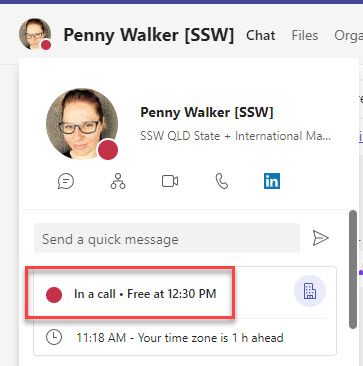
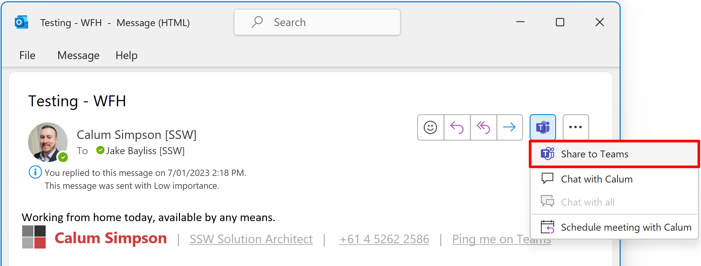
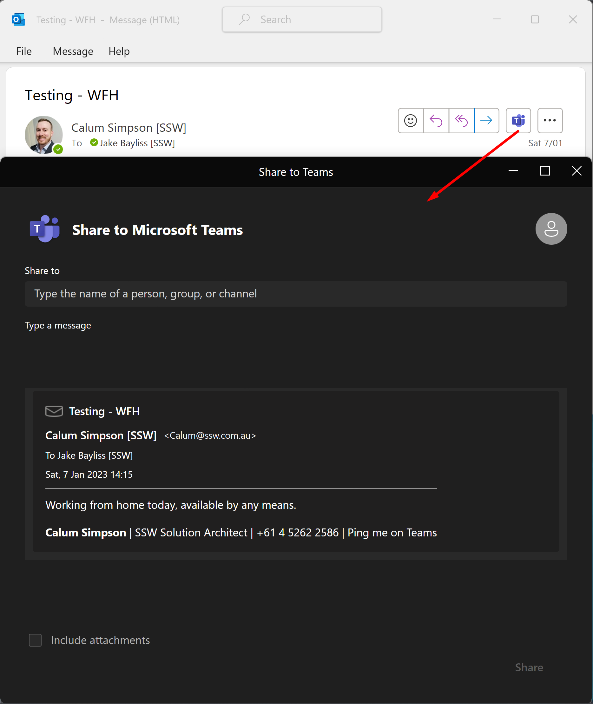

It can be very jarring when somebody is called out of the blue and they are not expecting it. They might be deep in a task or talking to a client and by calling them their focus is getting disrupted.

Before calling someone, be sure [not to just say 'hello'](/no-hello).

A good way to initiate a call is to warm them up by giving a warning (e.g. *“Calling you in 1 min to talk about the Northwind production site being down 💀.”*)

<!--endintro-->

## The benefits of a warm call

* **Prioritization** - The other person can see what the call is about and can determine if it is a priority. For example, if you mention that you want to talk about an email from several years ago, they might think it isn't that important. Conversely, if you mention the production server is down, they will almost definitely answer you!
* **Consideration** - It gives the other person the time to prepare. They might be busy or in another call
* **Easier Responses** - It puts you into their chat history, so even if they decline the call, they can easily write back to you to explain why
* **Availability** - Giving someone even a 1 minute warning is a good idea even if you see their Teams Status is on green ‘available’. Remember it is not easy to always change their status to ‘busy’ - they could be on a mobile phone, on a WhatsApp call, in a physical meeting, etc

::: info
**Warning**: First check the persons Teams status is not "Do not Disturb", "Presenting", or "On a call" make sure **not** to call them unless it's an emergency.

:::

If the conversation has history, like a PBI/Issue or email, then it's important to [include the context](/add-context-reasoning-to-emails).

:::greybox
Calling in 1 minute. See the PBI/Issue:

**{{ URL }}**
:::
:::good
Good example - Includes PBI/Issue link for reference and doesn't leave anyone waiting
:::

**Tip:** For the example above, PBIs often have long URLs. Include a line break for better readability.

:::greybox
Calling in 1 minute about this email thread:

**{{ EMAIL SUBJECT }}**
:::
:::good
Good example - Includes email subject for reference and doesn't leave anyone waiting
:::

### Using Outlook | Share to Teams

Outlook can do some of the heavy lifting for you! You can directly paste an email into a teams message with one click.

:::good

:::

### What if your call is declined?

When a call is declined, it is important to follow up in order to ensure the task remains a priority and does not get forgotten.

:::greybox
"Tried to call - will try again in 1 hour"
:::
:::good
Good example - Send them a message indicating you will try again later
:::

**Tip:** The [follow-up effectively](/follow-up-effectively) rule will help you remember to call. 
