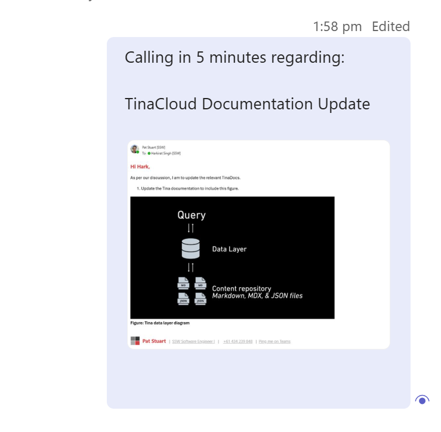

It can be very jarring when somebody is called out of the blue and they are not expecting it. They might be deep in a task or talking to a client and by calling them their focus is getting disrupted.

Before calling someone, be sure [not to just say 'hello'](/no-hello).

A good way to initiate a call is to warm them up by giving a warning (e.g. *“Calling you in 1 min to talk about the Northwind production site being down 💀.”*).

<!--endintro-->

::: greybox
**Hot Calling**

The only good reason not to give a warning before calling is when the person is already expecting your pre-arranged call..
:::

## ✅ The benefits of a warm call

* **Prioritization** - The other person can see what the call is about and can determine if it is a priority. For example, if you mention that you want to talk about an email from several years ago, they might think it isn't that important. Conversely, if you mention the production server is down, they will almost definitely answer you!
* **Consideration** - It gives the other person the time to prepare. They might be busy or in another call
* **Easier Responses** - It puts you into their chat history, so even if they decline the call, they can easily write back to you to explain why
* **Availability** - Giving someone even a 1 minute warning is a good idea even if you see their Teams Status is on green ‘available’. Remember it is not easy to always change their status to ‘busy’ - they could be on a mobile phone, on a WhatsApp call, in a physical meeting, etc

::: info
**Warning**: First check the persons Teams status is not "Do not Disturb", "Presenting", or "On a call" make sure **not** to call them unless it's a high priority item or a scheduled meeting. E.g. a Sprint Review

:::

## Giving context

If the conversation has history, like a PBI/Issue or email, then it's important to [include the context](/add-context-reasoning-to-emails).

### Option A: No context

::: greybox
Calling in 1 minute.
:::
::: bad
Bad example - The recipient has no idea what you are calling about
:::

### Option B: Generic context

::: greybox
Calling in 1 minute about the SysAdmin candidate.
:::
::: good
OK example - Includes context although the other person can't easily find out more
:::

### Option C: Specific context

::: greybox
Calling in 1 minute. See the PBI/Issue:

**{{ URL }}**
:::
::: good
Good example - Includes PBI/Issue link for reference and doesn't leave anyone waiting
:::

**Tip:** For the example above, PBIs often have long URLs. [Include a line break](/format-new-lines/#urls) for better readability.

::: greybox
Calling in 1 minute about this email thread:

**{{ EMAIL SUBJECT }}**
:::
::: good
Good example - Includes email subject for reference
:::

For [cross approvals](/cross-approvals), pinging the approvers with their priority order number shows how many you have attempted to contact before them, and how many are after if they can not take the call.

::: greybox
Calling you in 2 minutes to review a code change - Code Master (3/5)
:::
::: good
Good example - Includes priority order numbers to share how many other approvers you have attempted to contact
:::

### Option D: Add a screenshot

If you need to give more context than just text, sending a screenshot is a good option. If your call relates to an email, include the subject line.

::: good

:::

### Option E: Include email header/content in text

::: greybox
Calling in 5 minutes regarding:

**From:** Pat Stuart\
**Sent:** Tuesday, 14 October 2025 12:35 PM\
**To:** Harkirat Singh\
**Subject:** "Warn then call" rule - add good example

Hi Hark,

As per our conversation,

1. Please update <https://ssw.com.au/rules/warn-then-call> rule with a good example

:::
::: good
Good example - Forwarding then copying an email includes context by sharing the email and providing participant details
:::

### Option F: Use "Share to Teams" button

If you want to be extra clear, include the email with thread participants or a link to the email, especially when the thread includes multiple people or has similar subjects.

Outlook can do some of the heavy lifting for you! You can directly paste an email into a teams message with one click.

::: good

:::

## What if your call is declined/not answered?

When a call is declined, it is important to follow up in order to ensure the task remains a priority and does not get forgotten. You should follow up twice after the first call.

::: greybox
"Tried to call - will try again in 1 hour"
:::
::: good
Good example - Send them a message indicating you will try again later
:::

**Tip:** The [follow-up effectively](/follow-up-effectively) rule will help you remember to call.

## What if you are ❌ blocked and can't reach the person for a whole day?

If you still couldn't get hold of the person, and a decision needs to be made (aka blocked), you should write your recommendation, get a [cross-approval](/cross-approvals) and inform them.

::: greybox
"Tried to call with no luck. Since I'm ❌ blocked, I will move ahead with {{ THE RECOMMENDATION }} tomorrow.
(checked by {{ APPROVER }}).

Please get back to me if you prefer another way."
:::
::: good
Good example - Send them a message explaining how the next steps will move forward
:::
