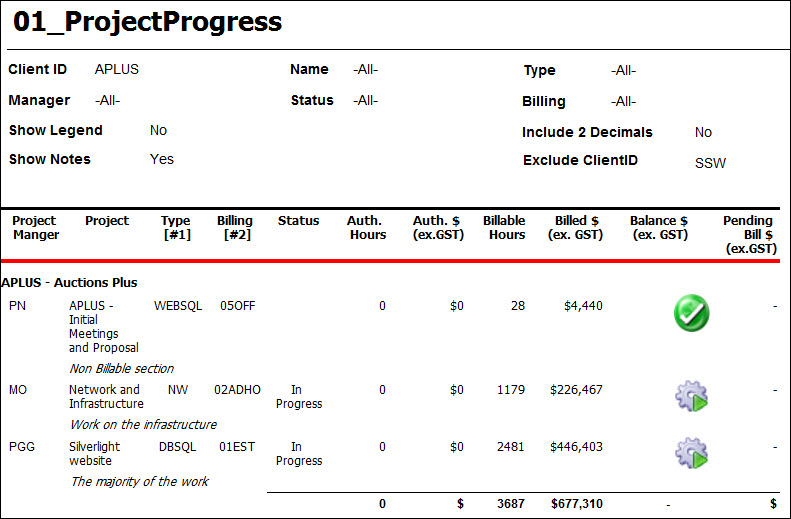
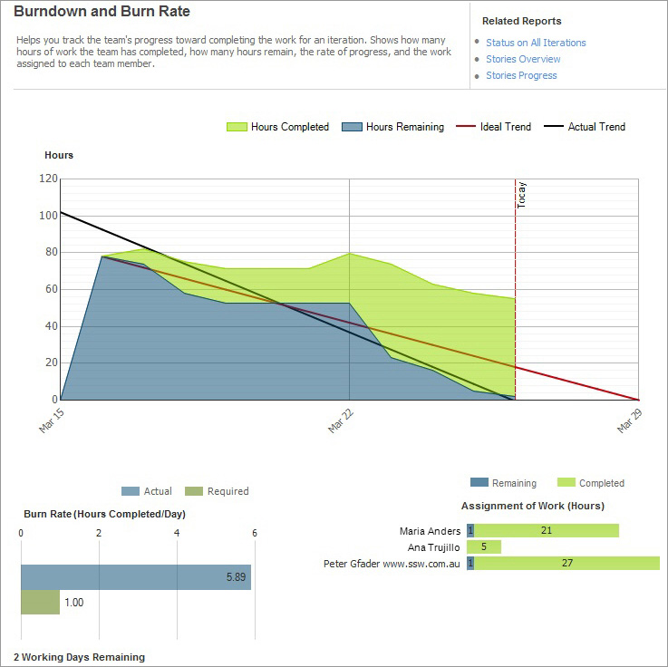
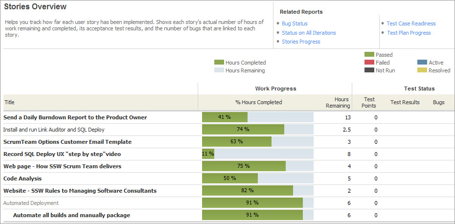

You're the one paying the bills, make sure you know where the costs are and how the project is progressing.

Insist on receiving these 3 reports in every Review Meeting:

<!--endintro-->

* Project Progress ($ spent)
* Burndown (ETA)
* Story Overview (testing quality)

Let's look at those 3 reports:

# 1. Current project costs

This allows you to see the actual costs of the project on a weekly basis.

**Figure 1: Project Progress – There is $30k spent and $8K outstanding** 
# 2. Current hours remaining and hours completed for the current sprint

**Figure 2: Burndown report - Shows the progress of the team in the current sprint – ETA is March 29 and Ana has no work to do** 
**Questions that the Burndown and Burn Rate report help answer:**

1. Is the team likely to finish the iteration on time?
2. Will the team complete the required work, based on the current Burn Rate?
3. Has the team added work to the iteration?
4. How much work does each team member have?

[How to Use the Burndown and Burn Rate Report](http://msdn.microsoft.com/en-us/library/dd380678%28VS.100%29.aspx) 

# Story Overview - See how each task is tracking

**Figure 3: Stories Overview report - Shows the progress of the User Stories in the current sprint and nothing has been tested and no active bugs** 
**Questions that the Stories Overview report help answer:**

1. How much work does each story require?
2. How much work has the team completed for each story?
3. Are the tests for each story passing?
4. How many active bugs does each story have?

[How to Use the Stories Overview Report](http://msdn.microsoft.com/en-us/library/dd380648%28VS.100%29.aspx)
