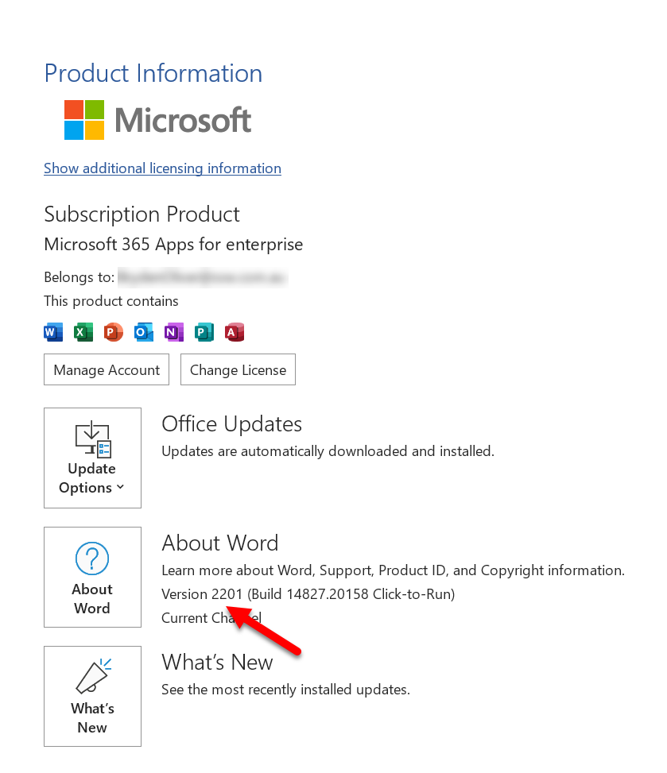
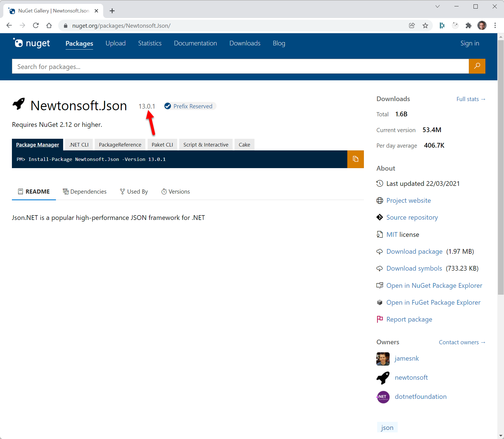

There are 2 very common types of software versioning. Knowing when it is appropriate to use each is important.

<!--endintro-->

## Simple Versioning

Simple Versioning is using a single incrementing sequence of integers to denote a version. This is an easy versioning scheme to automate, and the most common example of this is to quote the build number as the version. This means any user of the system can quote a version that developers can easily identify when reporting issues.

It can also be done differently but the main idea is to use a meaningful sequence of integers. For example, in Microsoft Office they use the last two numbers of the year and the two numbers of the month. e.g. 2201

If the Microsoft Office user also wants the hairy details, Microsoft also gives them the less user-friendly build number.

**When to use:**

Use this on websites and applications, it is generally found in the Help | About area. It is especially great on custom client projects where the whole project is all built together and a build is deployed. This is a quick and easy reference for your users.

## Semantic Versioning

Semantic Versioning has a multi part version eg 2.1.0. Changes in each of the different parts of the version mean different things. This is used to convey information to consumers of the project. 

**When to use:**

Use this if you are producing libraries or APIs where it's important to easily convey whether a **consumer might expect breaking changes**.

[More about Semantic Versioning...](https://www.ssw.com.au/rules/semantic-versioning)