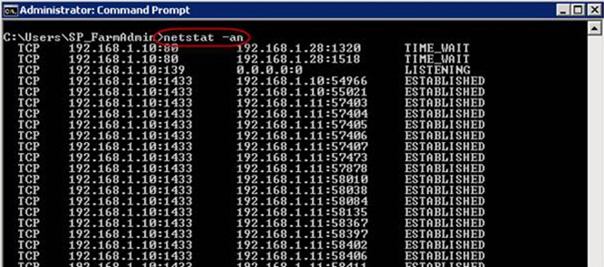
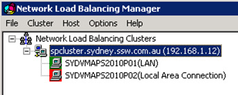
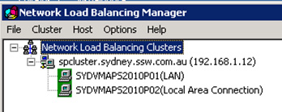

If you are dealing with a single server, there is no way to achieve 100% uptime, when updating or restarting a server.

So set your website up correctly with at least 2 front ends, and 1 backend (the SQL Server).

<!--endintro-->

[[goodExample]]
| 
Then, use a Network Load Balancer (we recommend Microsoft’s build in NLB) which allows you to spread web site load to multiple servers, but even more helpful when you need to do Windows Updates or make changes to web servers in your environment.

Follow the below steps on your test server first, get the application tested passed, then move on to production.

1. Open the  **Network Load Balancing Manager**
2. Right click on the machine you want to update | Select  **Control Host** | Click  **Drain Stop** 

3. To view the current connections on the server, open a command prompt and enter netstat -an. You will be able to see the connections list dropping as users are sent to the other server 

4. Allow the NLB to finish sending the connections to the remaining servers. The server you have drain stopped, will turn red when all the users have been moved to the other server

5. Optional – if you are using Hyper-V, take a snapshot of the server you are about to make changes on
6. Restart

(open the site and check its working)
8. Optional – Run any automated tests (for example Telerik Tests)
9. When the server ready, add it back into the load balancer. Right click on the machine | Select  **Control Host** | Click  **Start**
10. The server icon will return to green, and users will start being sent to the server again

(or multiple)

Congratulations you've just updated your servers with 100% uptime.
