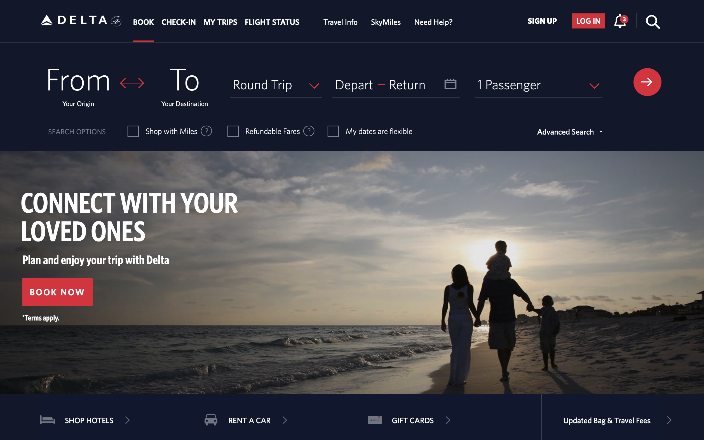

People rarely read word by word. Instead they scan the page, picking out individual words and sentences that seem more relevant.

<!--endintro-->

Keep it simple! It is important to break up information, not show it all at once. The visual organization of information is vital to legibility. When displaying information or controls, designers need to visually convey:

1. Information structure
2. Relation between elements
3. Importance and relevance of elements

::: bad

:::

::: good

:::
