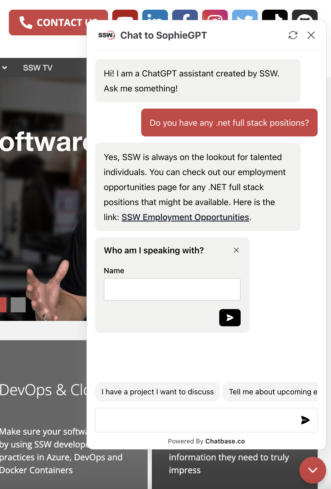
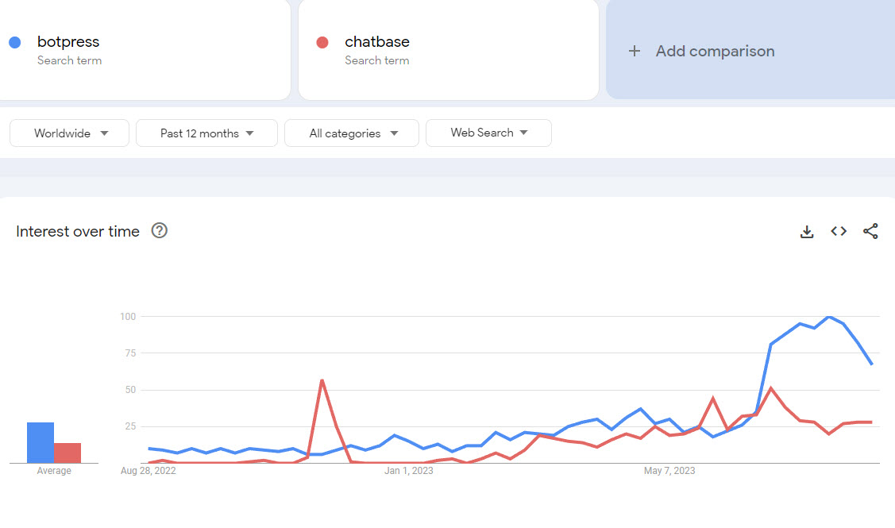

A chatbot is a computer program that uses artificial intelligence to engage in text or voice conversations with users, often to answer questions, provide assistance, or automate tasks. In the age of AI, good chatbots have become a necessary part of the User Experience. 

But what distinguishes a good chatbot from a great one? It's not just about automated responses; it's about intelligence and efficiency. 

<!--endintro-->

`youtube: https://www.youtube.com/watch?v=a1LSk3krUL0`
**Video: Do you know the best chatbot for your website? (8 min)**

Choosing the right chatbot for your website can be a challenging task. With so many options available, it's essential to find the one that best fits your needs and provides a good experience for your users.

::: img-small

:::

### Features to consider

Here are some key factors to consider:

#### Performance

* **Responses**: Smooth and natural responses that answer questions while understanding context.
* **Visual Design**: Aligns with brand aesthetics.
* **Content Tailoring**: Adapts responses to fit brand voice.

#### Development Effort

* **Pre-built Templates**: Speeds up deployment.
* **Drag-and-Drop Builders**: Simplifies creation without coding.
* **Documentation & Support**: Assists in development.

#### Ease of Access

* **Multi-Platform**: Seamless functionality on desktop and mobile.
* **Messaging App Integration**: Works with apps like WhatsApp, Messenger.
* **Language Support**: Multilingual for global reach.

#### Research and Training

* **API Support**: API integration for third-party applications.
* **Data Syncing**: Real-time synchronization for up-to-date responses.

#### Scalability

* **Traffic Management**: Handles varying user traffic levels.
* **Data Storage**: Manages increasing user data.

#### Handling Curveballs

* **Adaptive Responses**: Adjusts to unexpected user inputs.
* **Feedback Loop**: Improves from past interactions.
* **Human Agent Referral**: Transfers smoothly to a human if needed.

#### Resilience to Trick Questions

* **Response Filtering**: Identifies misleading questions.
* **Learning from Mistakes**: Improves trick question handling.  

### Comparing platforms

You might be torn between two popular platforms: [Botpress](https://botpress.com/) and [Chatbase](https://www.chatbase.co/). 

|          | GPT Integration                                          | Customization                | Pricing                     |
| -------- | -------------------------------------------------------- | ---------------------------- | --------------------------- |
| Botpress | ❌ Traditional style of workflow and steep learning curve | ✅ Wide range of integrations | ✅ Free to start             |
| Chatbase | ✅ Does everything with prompt engineering                | ✅ Easy customization         | ❌ Limited free plan options |

### Making the right choice

While both platforms offer unique features, Chatbase stands out as the superior choice in most instances. Here's why:

* Chatbase allows easy customization and integration with various tools
* Chatbase's user-friendly interface makes it accessible to a wide range of users. A prompt engineer can setup, tweak and improve the system. No development required
* Botpress lacks the intuitive interface of Chatbase, and is more prone non-sequeter conversation without extensive workflow development and testing

When selecting the best chatbot for your website, consider your specific needs and preferences. While Botpress offers a wide range of features, Chatbase's ease of customization, user-friendly interface, and robust GPT integration make it the superior choice for most users. 

Evaluate your requirements and choose the platform that best aligns with your goals.