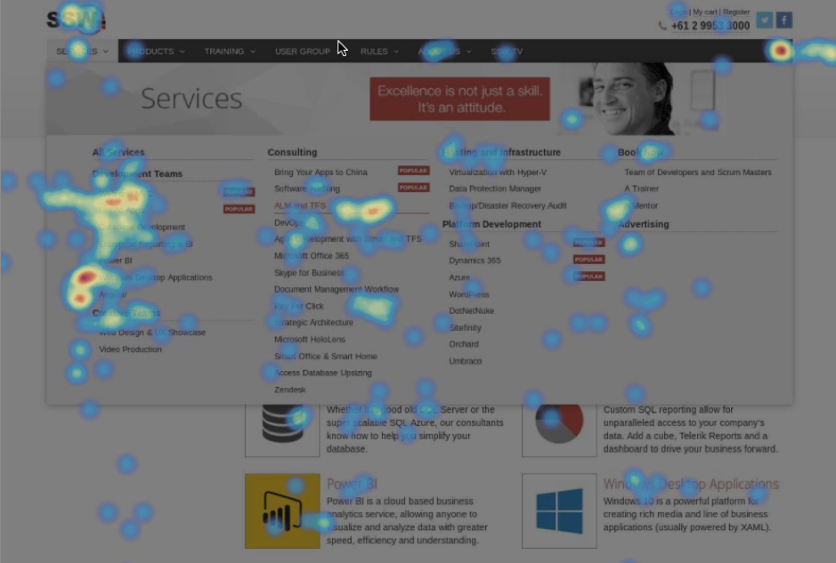

The user experience on your site is crucial to ensuring that you are effectively converting your leads into clients, but what if this isn’t happening?

<!--endintro-->

How can you work out where your site is going wrong and why? One key way to track how users are viewing your site is **heatmapping**, which track the behaviour of your users on your site through mouse tracking and eye tracking techniques.
 
At SSW we use HotJar to perform our heatmapping. This information then allows us to determine which areas of our site are performing efficiently, and areas we need to adjust for better performance.

