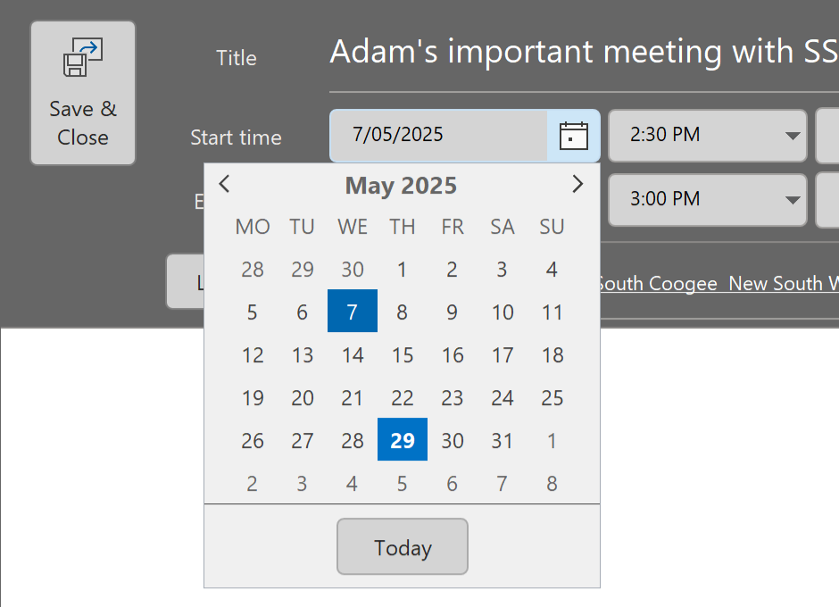
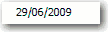
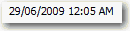
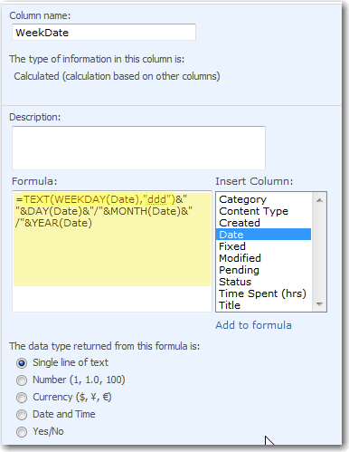
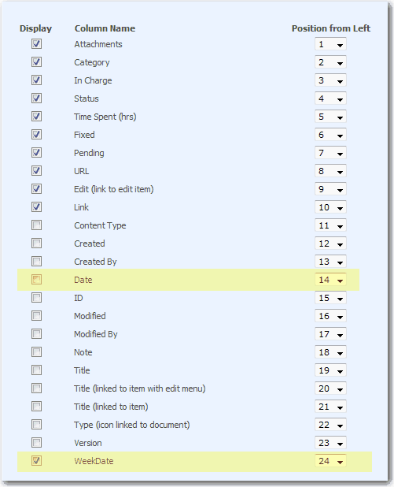

When designing date selectors in your UI/UX, it's important to include the weekday next to the standard date format `dd/mm/yyyy`. This small addition adds context, reduces user error, and speeds up decision-making—especially for bookings, scheduling, or deadline-driven interfaces.

To keep things clean and consistent, [use the **abbreviated** weekday format](/add-days-to-dates) (e.g., Mon, Tue, Wed). This provides clarity without cluttering the interface.

<!--endintro-->

::: bad img-medium

:::

::: good img-medium

:::

## How to do this in SharePoint

You can format dates to include weekdays using calculated columns and formulas in SharePoint.

By default, the date type column only have two format options in SharePoint.

To add the weekday (E.g. Wed) you need to:

1. Select **List Settings | Columns | Create column | Calculated** (calculation based on other columns)
2. See the columns of this list in the "Insert Column", add the column you want to change format, and custom the code in "Formula" like below:

  

3. Change the views of the list to use the new calculated column `WeekDate` instead of the original date column `Date`:

