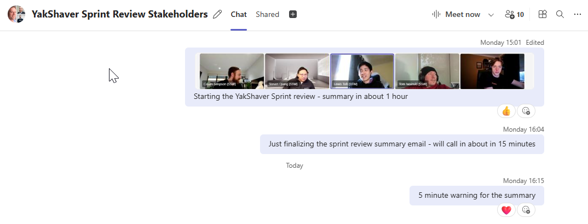

Sprint review is one of the [3 main Scrum meetings](/scrum-master-do-you-schedule-the-3-meetings).

This is the meeting where the Product Owner accepts or rejects the Product Backlog Items (PBIs) done in the Sprint. It is a second-to-last meeting in the Scrum cycle and is directly followed by the [Retrospective](/do-you-know-what-happens-at-a-sprint-retrospective-meeting).

The Team, having [prepared](/meeting-do-you-know-what-to-prepare-for-each-meeting) for the meeting, presents the PBIs to the Product Owner.

One person, often the Scrum Master, presents a summary to the Product Owner of the PBIs committed at the Sprint Planning meeting and the done PBIs being presented for acceptance. The Team seeks to have more PBIs accepted than originally committed. It is important that the Product Owner knows at the beginning whether The Team believes that they have over or underachieved the Sprint Goal.

The Sprint Review is most effective when recorded and aided by the Copilot.

<!--endintro-->

## Overview

There are a few main steps to the process. Some of them are optional, but they add significant value if you decide to commit. While some of the points below mention hosting a certain meeting, it can all be done in one to keep the context readily available.

0. The Team prepares all of the PBIs for review (Optional, recommended)
1. Draft the [Sprint Review + Retrospective email](/sprint-review-retro-email) (Optional, recommended)
2. **Host a Sprint Review meeting with the Team and the Product Owner**
3. Record the meeting to capture the discussion and gather insights (Optional, recommended)
4. Ask Copilot to analyse the recording (Optional, recommended)
5. **Host a Retrospective** (Required) and include the result in the email above (Optional, recommended)
6. Include the Copilot insights into the email above (Optional, recommended)
7. **Host a Sprint Summary meeting with the Team, Product Owner and relevant Stakeholders**
8. **Send out an email with the results of the Sprint Review to the Stakeholders**
9. **Host a Sprint Planning meeting**

You might have noticed that the list above mentions all 3 of the important Scrum meetings. While Retrospective and Sprint Planning are not part of the Sprint Review, it is essential to maintain the order above to convey the useful context from the previous meeting into the next one.

Now, let's jump into the specifics of the Sprint Review meeting.

## Main meeting flow

When the Team is ready, they start the recording. This is useful for process improvement and allows external tools to analyse the meeting and extract additional value and insights.

Each done PBI is presented by the Team for acceptance. They aim to get the PBI accepted as quickly as possible ([aka tick and flick](/tick-and-flick)) while being totally transparent, which includes declaring whether there are any known outstanding bugs (which should already be on the Product Backlog) and adherence to the Team's Definition of Done.

::: info

To keep stakeholders informed beyond the Sprint Review, you should record a [Monthly Stakeholder Video](/monthly-stakeholder-video) to share key progress, blockers, and upcoming priorities.

:::

`youtube: https://youtu.be/L94TEsTuLz4`

**Video: Explaining a PBI to a Product Owner with Jake Bayliss (5 min)**

If a PBI is accepted, but more work needs to be done, a new PBI to cover this work is added to the Product Backlog. Similarly, if a bug is found during the review, it is added to the Product Backlog.

If a PBI is rejected and returned to the Product Backlog but the Sprint itself is accepted, then a careful decision needs to be made. If changes have been checked-in to the Sprint's branch, then it must be established that these changes have no adverse effect. Otherwise, they must be carefully undone before the branch is merged with the trunk. For this reason, it is always safer to accept PBIs with conditions rather than reject them.

The Scrum Master keeps the meeting on track and to the Timebox by disallowing discussions not relevant to the acceptance or rejection of the PBI; this is often done by making a note to bring the subject up again in the [Retrospective](/do-you-know-what-happens-at-a-sprint-retrospective-meeting) Meeting.

This meeting is normally timeboxed to as many hours as there are weeks in the Sprint.

During the meeting, an email is drafted to be sent with the results of the Sprint and insights collected during the review and Retrospective. You can find out more about the suggested content of the email in the [Sprint Review + Retrospective email rule](/sprint-review-retro-email).

::: info

Copilot can take a while (approximately 15 minutes) to finish the processing of the Review content. That time is well spent on a Retrospective or a Backlog Refinement session to avoid idle waiting.

:::

## Sprint summary

When the Review is done, it is a good idea to host a brief summary meeting. The purpose of the meeting is to quickly summarise everything discussed in the review and share the most important points. This provides an opportunity for those who could not make the entire meeting or missed important context to get up to speed. It is also a great connection point for the wider range of stakeholders.

## Additional stakeholders

If there are additional stakeholders, make sure they get called in for the summary so they [stay in the loop](/loop-someone-in) and [up to speed on the current increment](https://www.linkedin.com/posts/scrum-trainer_scrum-agile-activity-6815396232366837760-Mhnb/).

* Ping them in a Teams chat when the meeting starts

**Note**: Stakeholders often have a lot on their plate... Make their life easier by renaming the group chat so it's clear which project's review is about to start (e.g. **"{{ TEAM NAME }} Sprint Review Stakeholders"**)

* [Warn again just before adding them for the summary](/warn-then-call)

::: greybox

**When you ping stakeholders, include a message like this**:

Hey {{ PROJECT NAME }} Stakeholders:

I'm recording the Sprint Review and Sprint Planning so I can get the Copilot stats.

I'll stop the recording to do the Retro to give the recording time to save.

I'll call you and the stakeholders in {{ XX }} mins, {{ PRESENTER NAME }} will run the Sprint Summary.

The stakeholders are:

{{ STAKEHOLDER NAME }},

{{ STAKEHOLDER NAME }},

{{ STAKEHOLDER NAME }}

Let me know if you want anyone else added.

{{ SCREENSHOT OF CURRENT ATTENDEE }}

:::

::: info

**Tip**: (Optional) Ask stakeholders for Copilot AI images **before the summary meeting** to include in the summary email.

:::

::: good

:::

## What if you can't attend the Sprint Review

If you can't attend your team's Sprint Review (e.g. you're on leave, working part-time, or in a different timezone), you should give the team a summary of where you're at, so they can inform the stakeholders on your behalf.

* Send a brief "Sprint Review" email to the team to provide them with an update on the status of your tasks. This will enable the team to pass on the information to the client.

::: email-template

| | | |

| -------- | ------------------------------------------------------------------ | --- |

| To: | {{ YOUR SCRUM MASTER }} | |

| Cc: | {{ YOUR TEAM }} | |

| Subject: | {{ YOUR NAME }} - Sprint Review {{ SPRINT REVIEW NUMBER }} Summary | \ |

::: email-content

### Hi Team

I won't be able to make the Sprint Review because {{ REASON }}. Here's an update on my PBIs:

* PBI {{ PBI NUMBER }} - Done - Done Video in the PBI ready to show the client.

* PBI {{ PBI NUMBER }} - Blocked - Waiting on {{ BLOCKER }}. Details in the PBI.

...

:::

:::

- - -

::: greybox

Learn more about the meetings in Scrum:

* [Sprint Planning Meeting](/what-happens-at-a-sprint-planning-meeting)

* Sprint Review Meeting (this rule)

* [Sprint Retrospective Meeting](/what-happens-at-a-sprint-retrospective-meeting "Sprint Retrospective Meeting")

* [Daily Scrum (Stand-up) Meeting](/methodology-daily-scrums "Daily Scrum Meeting")

**Tip:** It can be helpful to finish the **Sprint Planning meeting** with the first **Daily Scrum** of that Sprint.

:::

- - -

::: info

**Not doing Scrum?**

Even if your client does **not** want to do Scrum (they might have had a bad experience in the past), you should still do this step, just under a different name.

E.g. *"Hey Bob, let’s schedule a catch up on Friday. Then I'll show you what I have done this week"*.

:::
