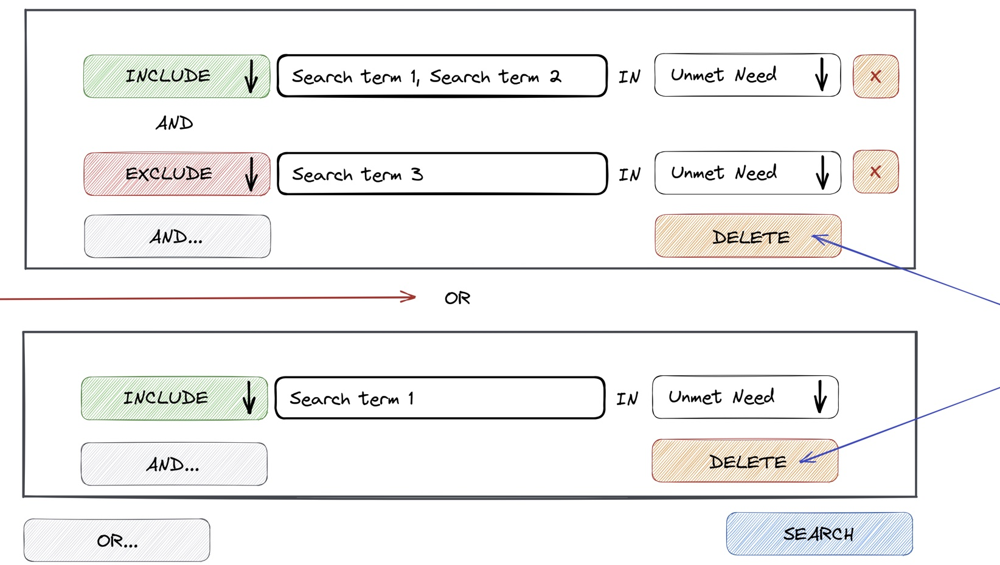
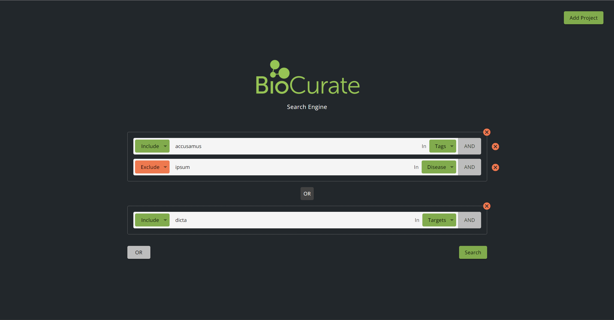

You would never build a house without getting an architect to create a plan first. Usually, a specification process is done with the client before beginning work on a project. 

<!--endintro-->

As expected, it's not realistic to fully understand the complexity of a client's system, and give an accurate estimate after one brief meeting. For most business solutions, a few days are needed to obtain and document the requirements of the project’s stakeholders and, in turn, transform those ideas into a more detailed roadmap.

## Deliverables

The deliverables for the Specification Review depend upon how large the application is and the time spent on the review. On completion of the Spec Review, the client will receive the following:

### Requirement analysis

* An architectural roadmap recommending technical solutions
* A breakdown of the required software application into its core components, likely to include the approximate number of main features (e.g. forms, reports, etc.)
* An integration plan
* A deployment strategy
* An MVP (Minimum Viable Product) will be identified, as well as a wish list - requiring the client to set the priorities for the project by defining what is in and out of scope for the MVP
* A detailed list of 'issues' associated with the existing system which impact future development and maintenance
* Hardware and licensed software recommendations
* Mock-ups if required

### Product Backlog

* A list of Product Backlog Items (PBIs) will be broken down based on the requirements analysis and the architectural design
* These PBIs will then be estimated

### Ballpark $ estimates

* The estimated number of Sprints
* The estimated number of developers
* The estimated cost of the project

::: greybox

These [deliverables](/specification-review-presentation) can be presented as either:

* A high-level PowerPoint presentation 
* A Word document
* A video presentation

:::

## From wireframes to the final product

During the Spec Review process, we create wireframes to give the client a preview of the functionality and look of their proposed solution.

These wireframes are utilized in key stages of the development process:

* The developers talk to the client to gain a deeper understanding of their needs
* The developers design the wireframes for the client to envisage and sign off
* These wireframes are the direct reference developers use to work from 
* The developers send the product back to the client to test
* The developers showcase the final product with a Done Video

Let's take a look at a real-world example.

These wireframes were created during the Spec Review and provided insight into the functionality of the client's new search engine to both the client and the developer.

As you can see, the wireframes allow you to gain a 'glimpse into the future' and give the clearest possible depiction of the end product.
