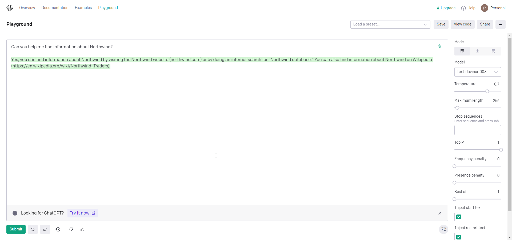

ChatGPT is a refined version of GPT-3, think of it as a GPT-3.5. Essentially, it takes the model of GPT and turns it into a chat bot that responds in a human-like manner.

<!--endintro-->

ChatGPT provides a more realistic interaction for end-users, a more user-friendly interface and a softer set of responses.

For example, if you asked GPT-3 "Can you help me find information about Northwind?" it would provide you a very direct answer that may lack some tact.

On the other hand, ChatGPT provides a human-friendly response.

