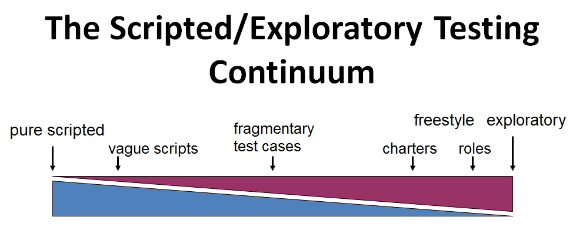

intro

<!--endintro-->

### Definition

My definition of ET - use latest Bolton/Bach

::: greybox
Testing is the process of evaluating a product by learning about it through exploration and experimentation, which includes: questioning, study, modeling, observation and inference, output checking, etc.
:::

earlier: 

Exploratory Testing is an approach to software testing that emphasizes the personal freedom and responsibility of each tester to continually optimize the value of their work by treating learning, test design and test execution as mutually supportive activities that run in parallel throughout the project

### Why is exploratory testing important?

why I think it’s so important

### How does exploratory testing compare with scripted approaches to testing?

However you currently perform testing within your team, your approach will belong somewhere on a continuum from a purely scripted form of testing to a fully exploratory form of testing:

A purely scripted approach is favoured by the factory school of testing, where scripts are created in advance based on the requirements documentation and are then executed against the software later, potentially by someone different than the author. The idea here is that everything can be known in advance and coverage is known and guaranteed via the prescriptive steps in the test case. This approach is obviously very rigid and does not account well for when unexpected things happen during execution of the script or for the fact that different testers will execute the exact same steps differently (breaking the so-called benefit of "reproducibility" in purely scripted testing).

Scripts can be made more vague, by specifying the tests in a step-by-step fashion but leaving out any detail that does not absolutely need to be specified (one way to do this is to omit the "Expected Results" for each step, thereby making the tester think more about whether what they see is what they realistically expect to see). You can then consider a more improvised approach in which you still have scripts, but **actively encourage deviation from them**.

A middle ground is fragmentary test cases, where you specify tests as single sentences or phrases, eliminating the step-by-step detail and omitting prescriptive expected results. Charters are a key concept in managing exploratory testing but they basically specify a mission for a timeboxed period of testing (say, 90 minutes), with the mission being expressed in two sentences or less - enough direction to focus the tester on their mission, but leaving enough freedom for the tester to exercise their judgment and skill.

Another exploratory approach is to assign each tester a role to test a certain part of the product, then leave the rest up to them. The use of heuristics becomes more critical and valuable as you approach this exploratory end of the continuum, to help the tester come up with test ideas during their freestyle exploratory testing.

### Pros and cons

#### Pros

good

#### Cons

not good

### Some exploratory testing myths

dispel some myths here (good content on the Quest wiki)

### More resources

Cem Kaner video

James Bach & Michael Bolton [History of Definitions of ET](https://www.satisfice.com/blog/archives/1504)

James Bach & Michael Bolton [Exploratory Testing 3.0](https://www.satisfice.com/blog/archives/1509)

**Add your rule to a category**