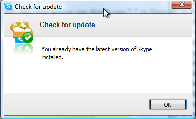
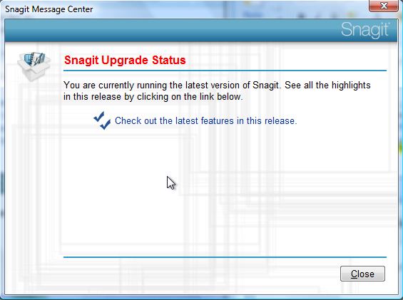
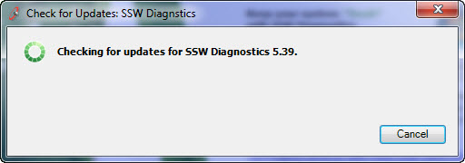
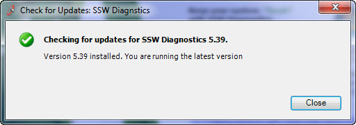
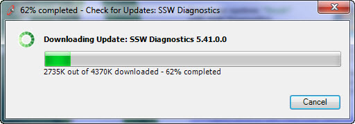

As per the rule [Do you know there should be a standard menu item "Check for Updates"?](RulesToBetterWindowsForms.aspx#CheckForUpdates) on Rules to Better Windows UI, you should have a standard menu item "Check for Updates" in the Help menu.

<!--endintro--> 

Here are a couple of examples of Check for Updates results:

::: bad

:::

::: bad

:::

::: good

:::

More Information:

If you implement this code from the SSW Toolkit, you will get this UI.

