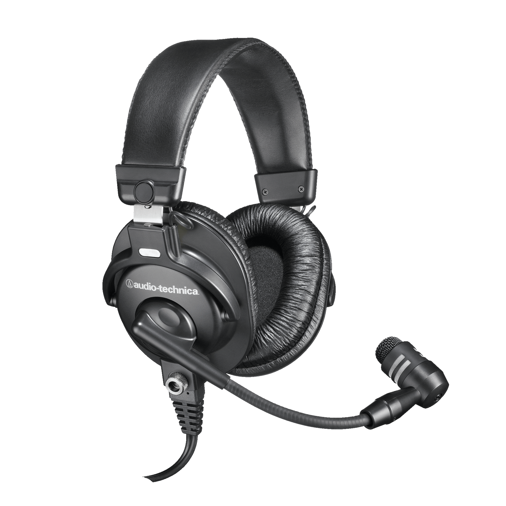
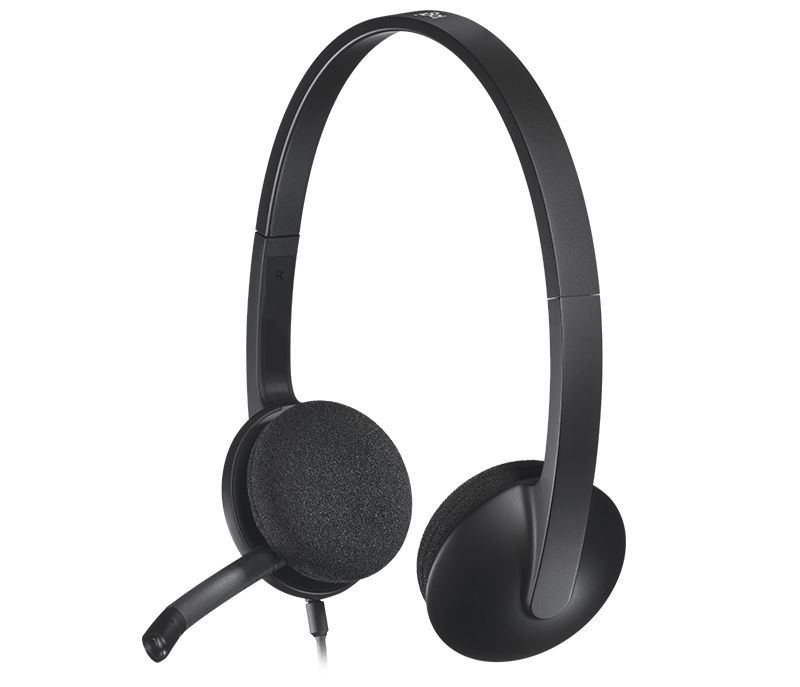
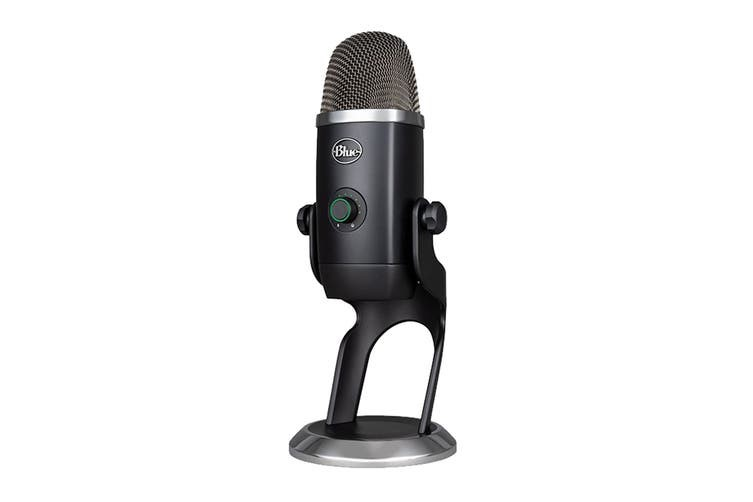
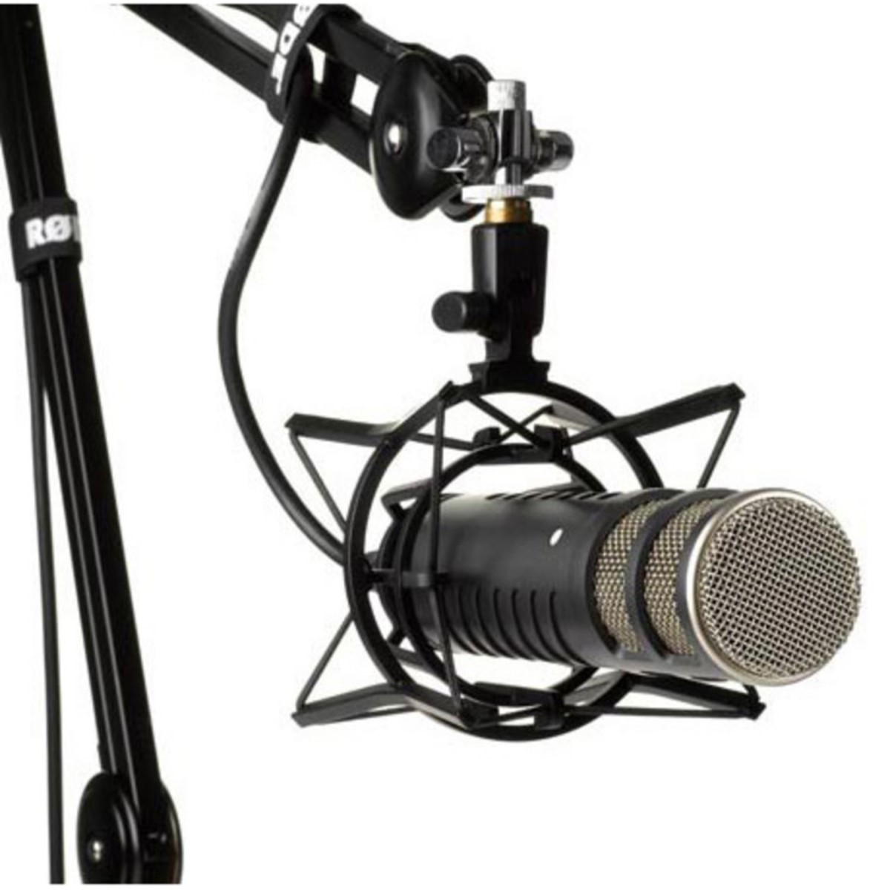
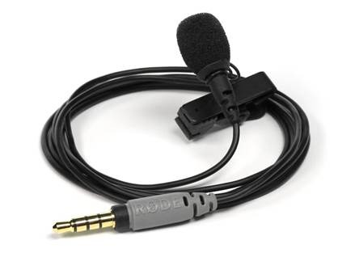
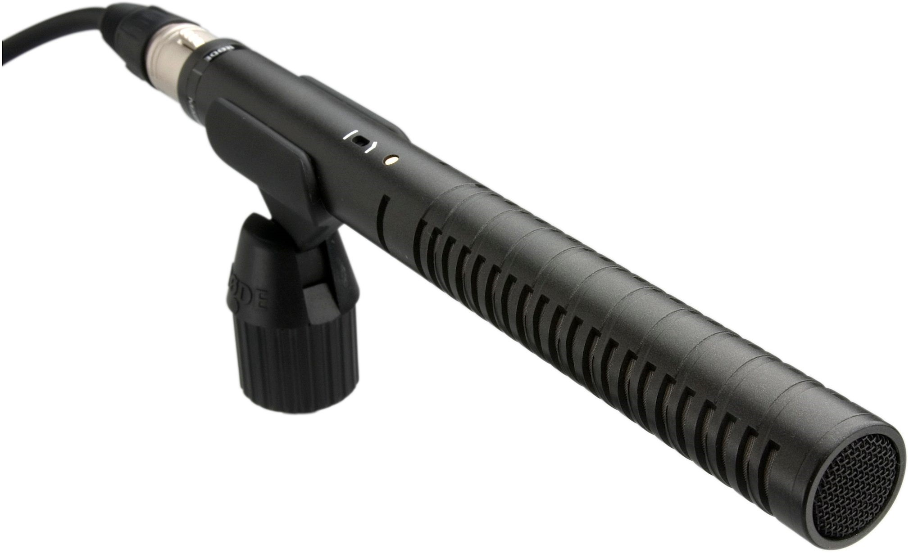

Depending on the type of video you are making, you will need to decide what microphone works best for you.

<!--endintro-->

### Webcam/built-in microphone

The most common type of microphone many of us use is the built-in one on your laptop.
While some modern ones are a little more advanced than normal, they generally offer the poorest sound quality out of any microphone type. This is because they’re designed for conferencing and web calls, which prioritizes things like ambient noise cancellation. This can sound like a benefit, but in reality, it causes audio to sound ‘tinny’ vs proper microphones.

### Headset microphone

Headsets are handy because they offer combined audio feedback and microphone in one.
**This is the recommended setup for most people.** 

A headset mic offers the advantage of being very close to the source of the audio (your mouth), which is important to consider when recording video.

Some headsets are better than others, we recommend the [Audio Technica BPHS1’s](https://www.audio-technica.com/en-us/bphs1) like the ‘go-to’ option for really great broadcast-quality audio recordings.

  

On the lower end, the [Logitech H340](https://www.logitech.com/en-au/products/headsets/h340-usb-pc-noise-cancelling-mic.981-000477.html) USB headset is a good option.

  

**Warning:** These look poor on video.

### Desktop microphone – portable

Desktop mics can offer better audio quality than headsets mics overall.

There are many models to pick with different characteristics. Our choice is the [Blue Yeti X](https://www.bluemic.com/en-us/products/yeti-x/). It connects via USB to your laptop and works without additional drivers.

  

### Desktop microphone – non-portable

You can go beyond a portable desktop mic and get something like the Rode Procaster mic on an arm. These are typically used by professional podcasters.

  

### Lapel microphone

Lapel mics are a great option for both mobile and PC devices.

The Rode smartLav+ is a lapel that works on devices that support TRRS connectors (phones, tablets and modern laptops).
The benefit of this type of mic is that it is placed on your shirt and close to your mouth, which provides cleaner audio and more ambient noise rejection.

  

**Warning:** [The cable can look poor on video](https://www.youtube.com/watch?v=3YbAGcB2LgQ&feature=emb_title).

### Shotgun microphone

Shotgun Microphones are, by definition, built to capture the audio from the source they are directly pointed at. They are designed to cut out audio from other directions. This means that if someone behind the microphone says something, it will likely not be picked up clearly.
These are traditionally used on film and TV sets and offer among the highest quality recordings.

  

