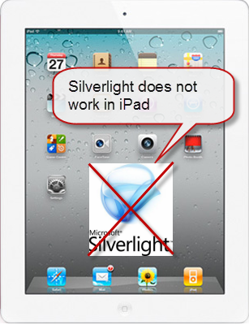

There is a place for Silverlight, but it can only be the 'richer' experience. In some cases, it is better not to use Silverlight for Data Entry Form and also content publisher should have the alternative to Silverlight for Android & iOS users.  

<!--endintro-->

**Mobile Device**

  

**Data Entry Forms** 

NO. HTML must be the default experience. Microsoft says for Business Apps, but be careful. Silverlight is \*Not\* for data entry forms. Tab Index Implement is very hard and end result isn’t consistent among the popular browsers. Users frequently use tab to move from Text Box to another Text Box and require consistent experience while entering data using a different browser. HTML 5 introduced autofocus, placeholder and validation feature which is useful for creating consistent Data Entry form for various browser.

Useful Links: 
   [HTML 5 Form Elements](https://www.w3schools.com/html/html_form_elements.asp)

 

**Microphone or Camera** 

YES, You can access the camera & microphone from Silverlight. System.Windows. Media.CaptureSource object provides methods and properties used to work with audio and video capture devices. In essence, CaptureSource is like a little media player. After the video being captured, We can give ShaderEffect or manipulate captured still image.

Useful links: 
   [Learning Video](http://www.silverlight.net/learn/videos/silverlight-4-videos/access-web-camera-microphone/) 

 

**Socket Communication** 

YES. System.Net.Sockets.Socket Class provides a set of methods and properties for network communications. The Socket class allows you to perform asynchronous data transfer using any of the communication protocols listed in the ProtocolType enumeration. Currently, the only supported ProtocolType is the TCP protocol. Supported Version Silverlight 4 & 3. 
   [MSDN – Socket Class](http://msdn.microsoft.com/en-us/library/system.net.sockets.socket%28v=vs.95%29.aspx)

**For interactive charts in a BI (** ***Business Intelligence*** **) solution** 

NO. There are some aftermarket solutions available. Notable are Telerik Silverlight Control, [Infragistics](http://www.infragistics.com/dotnet/netadvantage/silverlight/data-visualization.aspx)  Silverlight Data Visualization. 
      [Telerik](http://www.telerik.com/products/new-silverlight-controls.aspx) provides BI solution using Advanced GridView, Charts with zooming, scrolling, multi-level resource grouping. Both solutions use shared API across Silverlight and WPF, as a result product users can visualize data in more flexible way. 

 

**For Richer TextBox** 

YES. Using Silverlight Rich TextBox user can format Text, insert image, DataGrid, Calendar, display Text right-to-left, print content, and can access clipboard. Accessing 
   [Clipboard](http://msdn.microsoft.com/en-us/library/system.windows.clipboard%28v=vs.95%29.aspx) can be implemented by using Clipboard Object. Selected Text context can be implemented using 
   [Popup](http://msdn.microsoft.com/en-us/library/system.windows.controls.primitives.popup%28v=vs.95%29.aspx)   Control. 
   [Sample in MSDN](http://msdn.microsoft.com/en-us/library/ff426926%28v=vs.95%29.aspx)

 

**For mapping apps** 

YES. Microsoft.Maps.MapControl provides functionality to access Bing Maps. Using script a site can implement map feature by referencing the Bing Maps Silverlight Control XAP file in an object tag. Here are some sample applications:  
   [Microsoft Bing Map](http://www.microsoft.com/maps/isdk/silverlight/) & 
   [DeepEarth Project](http://deepearth.codeplex.com/)

 

**Slow Response** 

The initial slow response is due to downloading of the .xap file. This is not an issue since it is a one-time download and the user gets a fast response with later interaction. For later visits, the user will not face a slow response issue as the browser already cached the data. Also, check out rules - 
   [Do you use dynamic application loading in Silverlight](/do-you-use-dynamic-application-loading-in-silverlight)?
