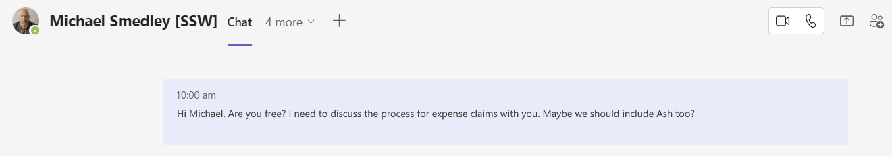
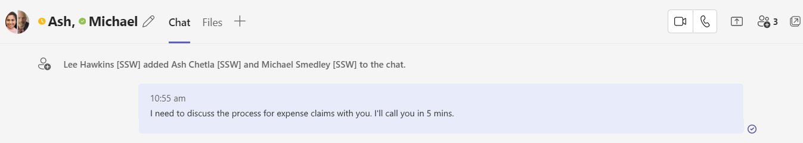
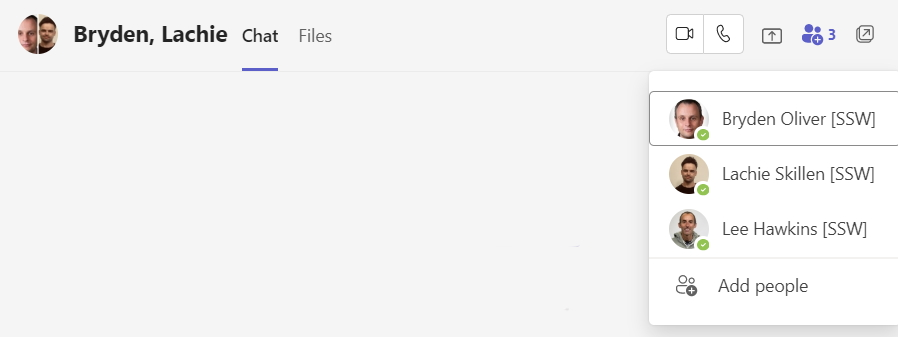

If you intend to talk about someone in your chat, it's best to add that person to a group chat. 

This approach is useful before starting a Teams call and you can simply say _"I'll call you in 5 mins"_ in your group chat to let everyone in the group know that you need to chat with them. 

Note that you shouldn't make the call if all of the participants have [Teams status](/use-the-status-message-in-teams) "In a call" or their status message suggests they shouldn't be disturbed.

<!--endintro-->

::: bad
 
:::

::: good
 
:::

::: bad

:::

::: good

:::

::: greybox
**Tip:** When deciding whether to use a group chat, think of how you'd approach the same conversation in an email - if you'd cc someone in the email, then you should include them in the group chat.
:::
