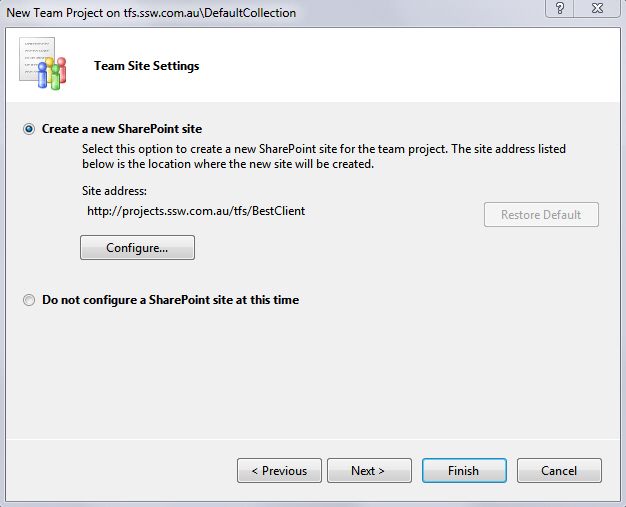
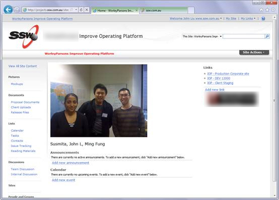

When a prospect/client is ready to move forward (typically after a Specification Review)...

<!--endintro-->

1. Create a TFS project (to track the work items and releases)
2. Create a SharePoint project site

   You can do both of these at the same time by creating a Azure DevOps project and use a SharePoint dashboard.
   

**Note:** It is also possible to [create a new SharePoint site afterwards and attach it to a Azure DevOps project, via this hack](/how-to-create-Project-Portal)

3. Move all the documents you've created for this client, from the 'Prospects Site (Document Library)' into the new project site.

A few other things to do frequently do right away:

* If required, create an external user account for the Product Owner. This enables the client access to your SharePoint Extranet to see the documents, sites and reports.
* If required, let the client know they can upload additional files, or download a copy of the project for testing and deployment.
* Check permissions and access rights
* Consider synchronizing the project documents offline via Outlook or SharePoint Workspaces
* Edit the SharePoint site landing wiki-page and upload some pictures of the team
  
