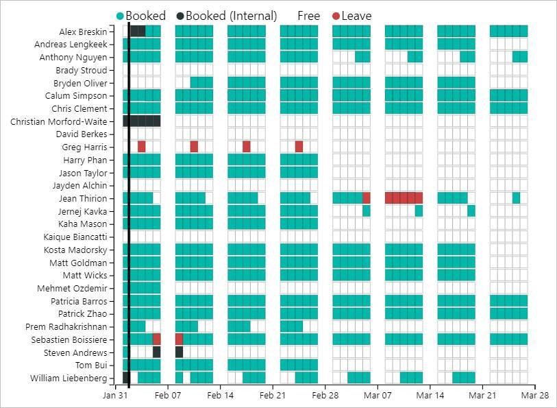

In a consulting company, you're always balancing having either not enough work or too much. When you're approaching full capacity (i.e. full utilization), either overall or in a particular skill niche, you should make sure you get approval to hire more people. 

 <excerpt class='endintro'></excerpt> 

​​​​When you do this, make sure you show your evidence so it's not just a gut feel. 

   <b>Hi Adam,</b>  We haven't hired any new devs in a while so can we please have some more?
<dd class="ssw15-rteElement-FigureBad">Figure: Bad Example​​ </dd>

   <b>Hi Adam,</b>  As per our conversation, we need more developers. I just lost 3 months of work (full-stack, React + .NET).  1. Please hire more devs asap  For more proof, check out our current bookings:   <b>Figure: The people who are not booked above are SysAdmins or Work Experience  - See the <a href="https://app.powerbi.com/groups/456358f7-5b12-46f5-b952-2a37fa9bb5e8/reports/a4069dc4-86c1-4cba-bf81-161bb108c5c2/ReportSection">Power BI report</a></b>  &lt;This email was sent as per the rule: <a href=/when-to-hire-more-people>https://rules.ssw.com.au/when-to-hire-more-people​</a>&gt;
<dd class="ssw15-rteElement-FigureGood">Figure: Good Example – shows current bookings to give weight to the decision. This is the email to send when you are out of resources​ </dd>
​ 

