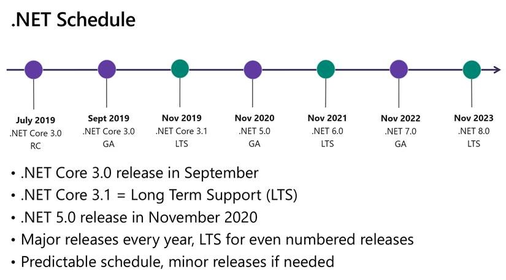

Long Term Support (LTS) versions of .NET Core / .NET 6+ are officially supported by Microsoft for 3 years following release.
So when considering which version to target for your application, the “Latest LTS when we first deploy to Production” is often the safest choice.
Non-LTS versions have much shorter support lifetimes.

<!--endintro-->

Deciding which version to target is not always as simple as "always choose LTS".

In many cases, the expected lifetime of a project is longer than this LTS lifetime so future upgrades to your project must always be considered.

The ongoing resources planned to work on this product must also be evaluated.

To help in these decisions,  the .NET Core team has released a roadmap for upcoming releases over the next few years. All even-numbered releases will be LTS.

  

Important questions to consider include:

* What is the planned lifecycle of the project?
* Will there be ongoing development in the future?
* How are we planning to distribute and support this project?
    * Web services that are automatically deployed to the cloud will be easier to continually update than a desktop app installed on customer PCs
* How does my project’s lifecycle align with the .NET release cycle?

All supported versions of .NET will receive servicing releases and the work to apply these updates should always be factored into the Total Cost of Ownership for any project.

A few invented scenarios are presented below:

###  Example 1

::: greybox
"It’s November 2020 and we are planning to launch the final version of our ASP.NET Core 3.1 API next week. There is no further planned development work in the next 12 months. If we upgrade to .NET 5 in the final Sprint, we would get a performance boost."

:::
 **Recommendation:** 
Although moving to .NET 5 could introduce a performance improvement, .NET 5 is not LTS and there is little future development planned. In this situation staying with the LTS .Net Core 3.1 is recommended.

### Example 2

::: greybox
"It’s November 2020 and Build 4463 of our ASP.NET Core API has just been deployed to Azure via GitHub Actions. We plan to continually develop new feature requests over the next 15 months, Finishing in January 2022”

:::
 **Recommendation:** 
When “continual development” is planned, it’s much easier to recommend working against the latest .NET version as it’s released. Upgrading incrementally during active development is often less painful than a larger planned upgrade between LTS versions 

### Example 3

::: greybox
"Once finished, we have no plans for further features for the next 2 years. Our planned launch date is October 2021"

:::
 **Recommendation:** 
The plan to reach “feature complete and done” followed by no planned subsequent work seems to suggest that development with an LTS version would be best.     
But if you look at the planned launch date, it’s 1 month before the next LTS release (.NET 6).
In this scenario, I would strongly advocate Developing against .NET 5, but leave some spare capacity to perform an update to  .NET 6 LTS soon after launch. 
Then the final, "stable" version will have a much longer support window.
