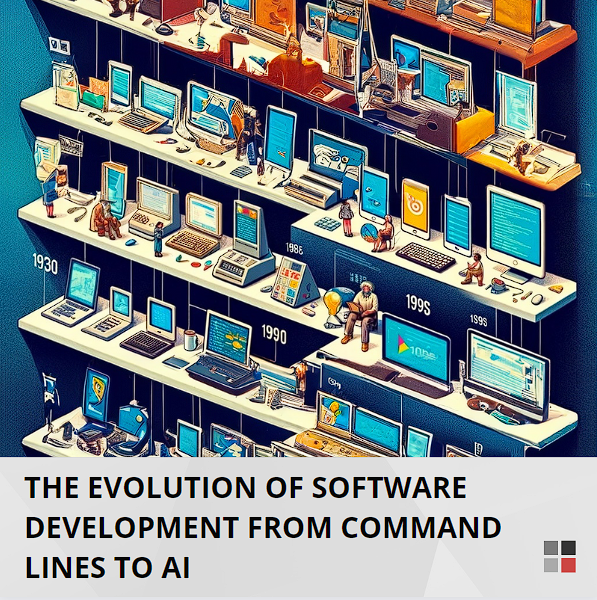

Canva is an intuitive online tool for creating images and crafty digital designs and is particularly effective for designing engaging social media memes. 

While Canva is a valuable design tool, it may not be suitable for every design requirement. It is essential to complement Canva with advanced design tools and occasionally integrate AI image generators for a comprehensive design approach.

<!--endintro-->

### Don't use Canva for complex designs

For intricate and complex designs requiring advanced editing or branding designers, professional software like [Figma](/figma-uses), Adobe Photoshop, or Illustrator is more appropriate. 

::: info
Do not use AI-generated images for social media content, as the current quality is difficult to match professional style.   
**Note:** This may be updated as AI imaging technology evolves.
:::

::: bad

:::

### Use Canva for simple memes on social media

Canva is great for creating memes due to its vast library of images, icons, and easy-to-use text overlay features. When crafting memes for social media, Canva’s templates can be a quick and effective starting point.

::: good

:::
