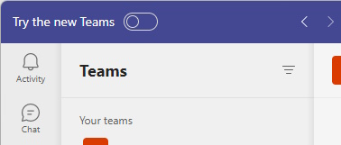
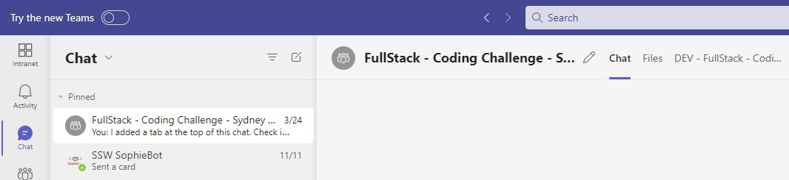
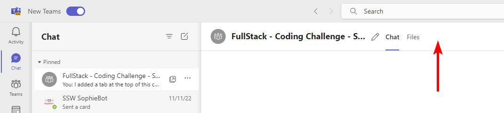
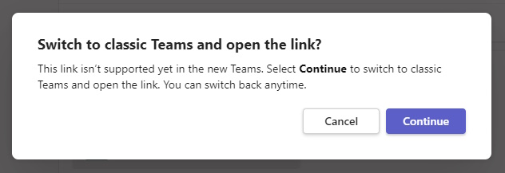

Using product previews is a great way to see what's coming next and give valuable feedback to the product team, and Microsoft Teams Preview is no different.

<!--endintro-->

There is some situations where you'd need to not use the preview version of Microsoft Teams, this is largely for features that are not supported yet.

At the time of writing, custom tabs and applications in chats are not supported.

If you do have links to these tabs, when clicking on the link you'll be presented with a message letting you know that it's not supported yet.

