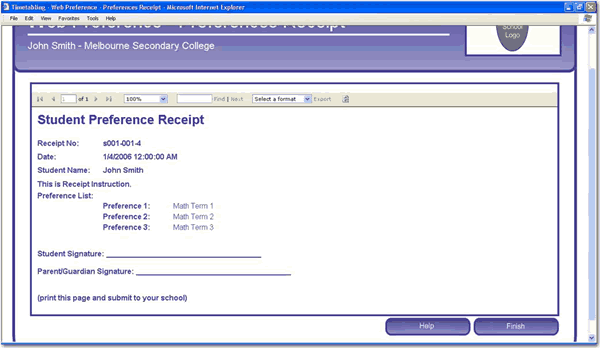

<!--endintro-->

From our experience, we have discovered these things about Reporting Services:

### Cons

* Parameters - you are forced to use built-in controls.
* Query string - when you change the parameters and refresh a report, the values do not appear directly in the query string, making it hard to copy/paste URLs.
* Can't separate SQL into a strongly-typed dataset or middle-tier object like in ASP.NET.
* There are potential difficulties with the deployment of RS reports and the exposing of them. However, once we have the infrastructure...
* Not able to work natively with modern .NET.

### Pros

* You can develop read only reports faster in Reporting Services than ASP.NET.
* Maintenance with RS is easier than ASP.NET, as with most cases you don't have to write any code.
* Flexibility with groupings and totals is easier. In ASP.NET you would need to iterate through the DataSet, keeping variables with the totals.
* Parameters are built-in. In ASP.NET there is code.
* Drilldown interactivity. In ASP.NET you need to code up a treeview.
* Users can have reports automatically emailed to them on a schedule.
* Users can export natively to PDF and XLS, plus a variety of other popular formats.

Nowadays, better technologies are used to handle reports. Examples include

* Power BI: cloud-based solution that provides visually appealing reports and dashboards.
* HTML based reports: HTML frameworks have evolved significantly, making it quick and easy to make great reports.

For a more detailed comparison between reporting solutions, take a look at our [Guidelines for Report Solutions - Web Clients](https://www.ssw.com.au/ssw/Standards/DeveloperDotNet/guidelinesforreportingwebclient.aspx).

