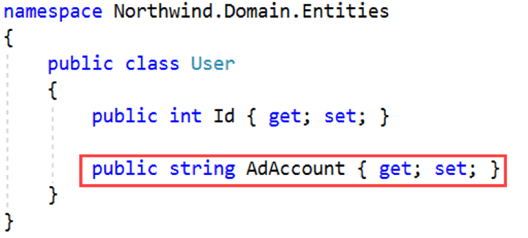
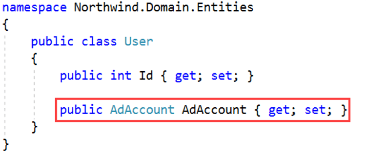
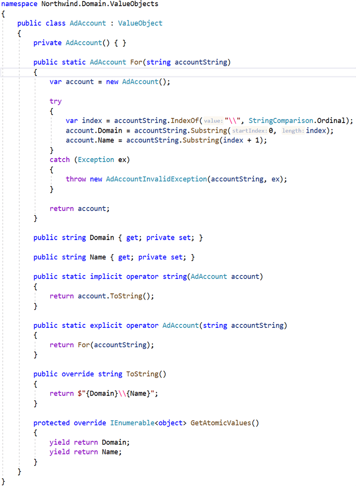
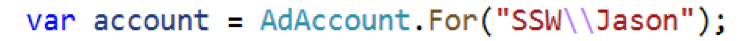
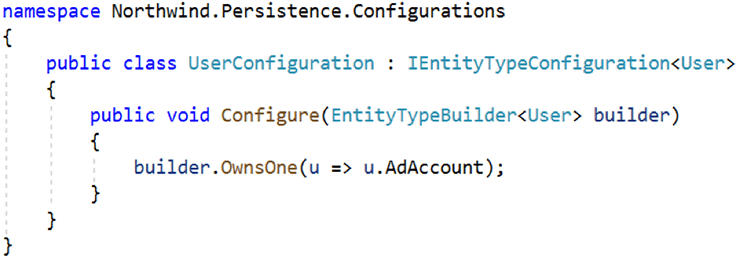

When defining a domain, entities are created and consist of properties and methods. The properties represent the internal state of the entity and the methods are the actions that can be performed. The properties typically use primitive types such as strings, numbers, dates, and so on.

<!--endintro-->

As an example, consider an AD account. An AD Account consists of a domain name and username, e.g. SSW\Jason. It is a string so using the **string** type makes sense. Or does it?

::: bad  
  
:::

An AD Account is a complex type. Only certain strings are valid AD accounts. Sometimes you will want the string representation (SSW\Jason), sometimes you will need the domain name (SSW), and sometimes just the username (Jason). All of this requires logic and validation, and the logic and validation cannot be provided by the string primitive type. Clearly, what is required is a more complex type such as a value object.

::: good  
  
:::

The underlying implementation for the **AdAccount** class is as follows:

::: good  
  
:::

The **AdAccount** type is based on the **ValueObject** type.

Working with the AD accounts will now be easy. You can construct a new **AdAccount** with the factory method **For** as follows:

  

The factory method **For** ensures only valid AD accounts can be constructed and for invalid AD account strings, exceptions are meaningful, i.e.      **AdAccountInvalidException** rather than **IndexOutOfRangeException** .

Given an **AdAccount** named account, you can access:

1. The domain name using; account.Domain
2. The username using; account.Name
3. The full account name using; account.ToString()

The value object also supports implicit and explicit conversion operators. You can:

1. Implicitly convert from   
   **AdAccount** 
       
  to   
  **string** using; (string)account
  
2. Explicitly convert from   
   **string** 
   
   to   
   **AdAccount** using; (AdAccount)"SSW\\Jason"

If you're using Entity Framework Core, you should also configure the type as follows:

  

With the above configuration in place, EF Core will name the database columns for the properties of the owned entity type as **AdAccount\_Domain** and **AdAccount\_Name**. You can learn more about [Owned Entity Types](https://docs.microsoft.com/en-us/ef/core/modeling/owned-entities) by reviewing the EF Core documentation.

Next time you are building an entity, consider carefully if the type you are defining is a primitive type or a complex type. Primitive types work well for storing simple state such as first name or order count, complex types work best when defining types that include complex logic or validation such as postal or email addresses. Using a value object to encapsulate logic and validation will simplify your overall design.
