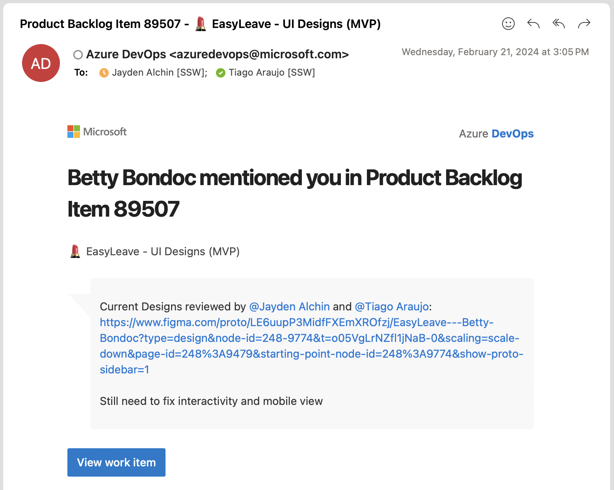
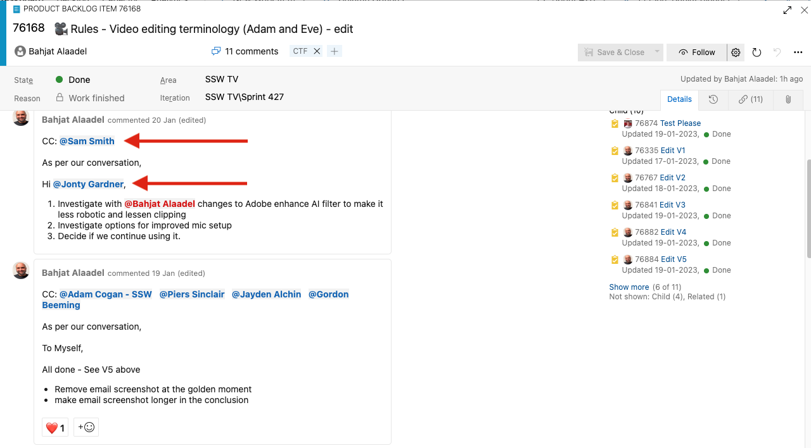

When the Product Owner verbally requests a change to a PBI, how do you update the PBI to reflect the change and also keep track of the conversation?

<!--endintro-->

You could send yourself a "[To Myself](/dones-do-you-send-yourself-emails)" email and update the PBI description accordingly, but only those people included in the email chain are aware of the conversation. Only send a "To Myself" email when there is no Product Backlog that is related to the request, otherwise you should create or update a PBI and @mention the Product Owner and other relevant people (@mentioned people will still receive an email).

::: bad

:::

Instead, what you should do is use the discussions feature in the PBI and mention the user using "@username".

The benefits of using descriptions and comments on PBIs:

* Quick and easy, no need to compose an email
* History is visible to anyone looking at the PBI (with email, if you don't cc them, they wouldn't have a clue)
* Easy to see all important information in one place, instead of digging through email

When someone (especially the PO) asks you to work on a PBI, @mention that person in the PBI description/comments so they get notifications about the tasks.

### Scenario

You are replying to *"Hey, can you please fix PBI 123?"*

::: greybox
*"I have found the PBI and moved it near the top of our backlog"*
:::
::: bad
Bad example - No @mention used
:::

::: greybox
"I have found the PBI, prioritized it near the top, and @mentioned you so you know when it is fixed"
:::
::: good
Good example - @mention included
:::

### GitHub Issues

::: good

:::

::: info
**Tip:** You can @mention on your pull requests as well.
:::

### Azure DevOps PBIs

To create a new PBI in your Azure DevOps project:

1. Navigate to **Boards | + New Work Item** and select the type that best suits your item
2. Enter your PBI title
3. @ mention your desired user in the description

::: good

:::

::: good

:::

It is also good practise to use @mention in the discussion to track changes and [request test pleases](/request-a-test-please). Try formatting your mentions like an email to clarify both accountability and responsiblity and identify the current status of the project.

::: good

:::

### Related Suggestion

* [Suggestion to Microsoft Azure DevOps - Help me know there is an image in the Work Item](https://bettersoftwaresuggestions.com/microsoft/azure-devops/help-me-know-there-is-an-image-in-the-work-item/)
