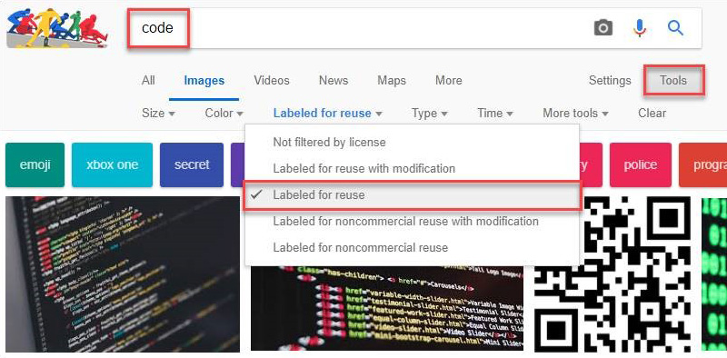

You will need to ensure that you have the rights to use these featured images. A few options include: 

 <excerpt class='endintro'></excerpt> 
<ol><li>Purchasing a subscription to a stock image site</li><li>Using a royalty-free stock image site. E.g. <a href="https://unsplash.com/" target="_blank">unsplash.com</a> or <a href="https://pxhere.com/" target="_blank">pxhere.com​</a> </li><li>Using Google Images that are labeled for reuse:  
   <dl class="image"><dt></dt><dd>Figure: Finding Images Labelled for Reuse within Google Images  </dd></dl></li><li>Taking your own photos</li></ol>
Ensuring you are not breaching copyright will save you from any trouble in the future.

 

