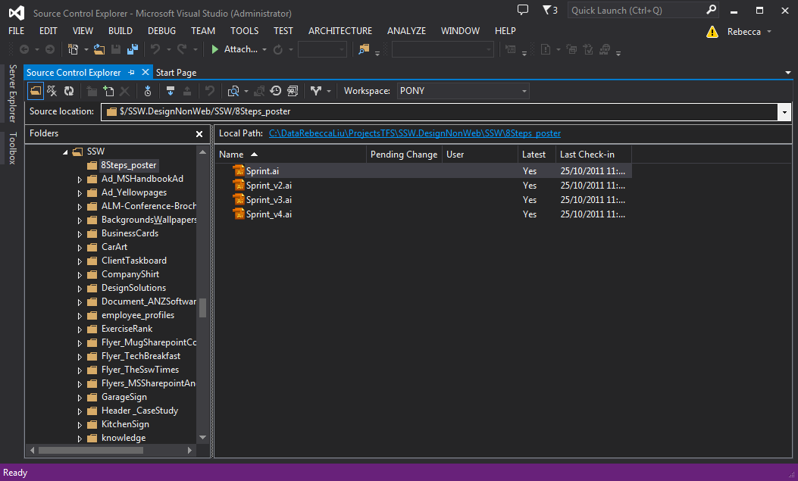
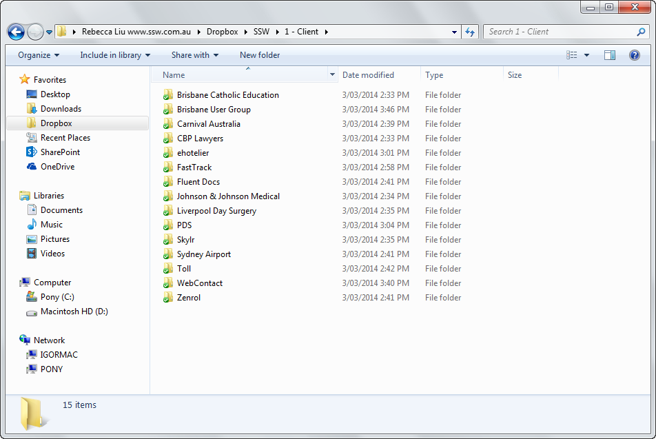
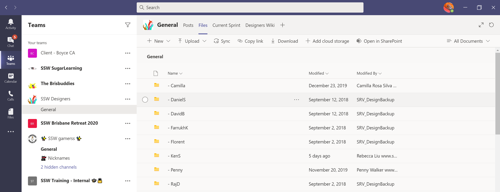

Design files should never be stored in Azure DevOps (was VSTS/TFS) or any other development file system.

<!--endintro-->

::: bad  
  
:::

::: good  
  
:::

::: good  
  
:::

::: china
Google Drive and Dropbox don’t work in China, so SSW prefers to use OneDrive.
:::

For developers, see [Do you know where to keep your files?](/do-you-know-where-to-keep-your-files)
