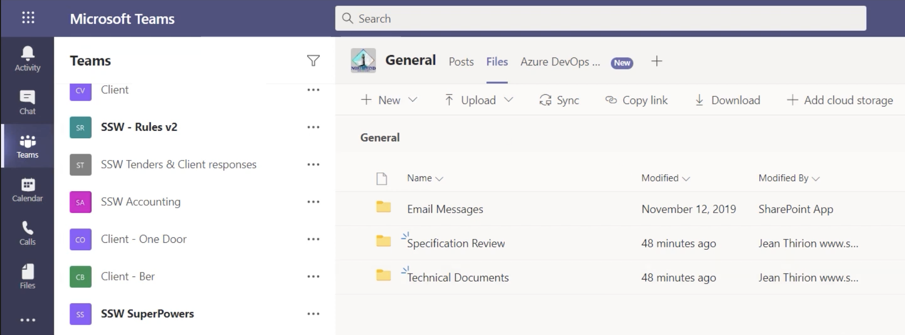
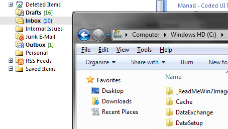
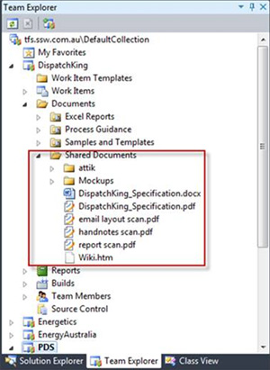
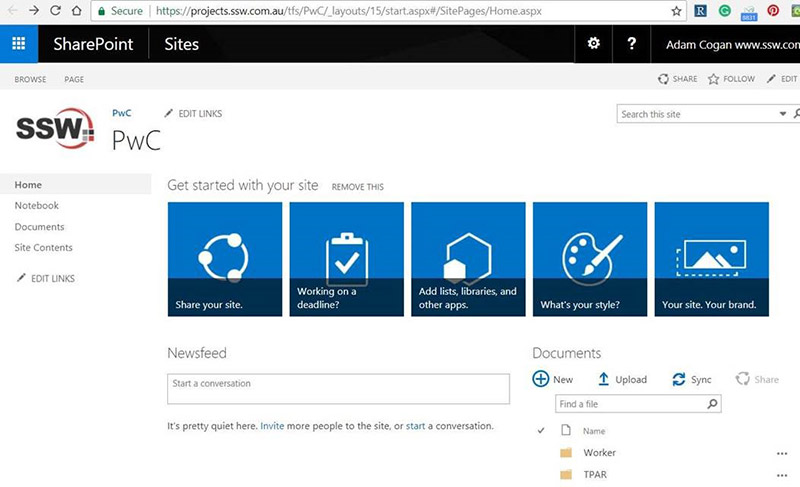
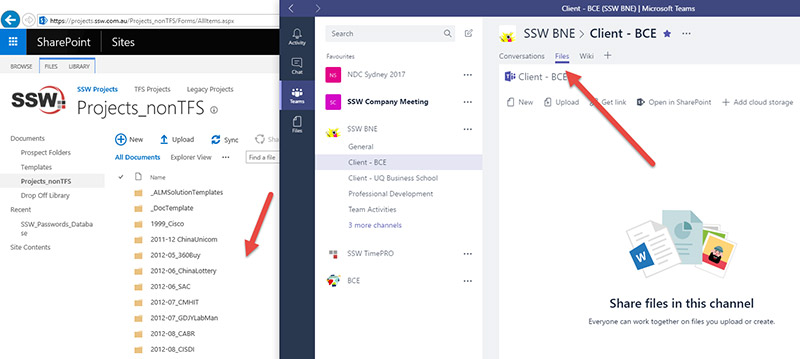

Each client project should have a nice place to keep files. In the old days, things were simple but limited, we simply used Windows Explorer and file shares. Today there are so many places that teams can store documents. E.g Dropbox, OneDrive, SharePoint, Microsoft Teams and Azure DevOps (was TFS).

  

<!--endintro-->

### Which is the best corporate solution?

The solution that allows the best collaboration with Developers, Project Managers, and other stakeholders is SharePoint and Microsoft Teams. It is super easy to create, upload, and share documents with others.

  

More at [Files - Do you store project documents in Teams?](/track-project-documents)

### What emails do you need to store?

More at [Sales - Do you track all sales related activities in CRM?](/sales-do-you-track-all-sales-related-activities-in-crm)

### What stuff do you need to store?

For most projects, you need to quickly store and locate important details and documents such as:

* Server details (Dev, Test, Production)
* Change-log documents
* Upcoming features (most often in Word or OneNote)
* General documents e.g. Requirements/Specifications (Note: it is possible to share documents from Microsoft Teams externally, but not from Teams directly... just open it in Office Online or a specific Office app first)

::: bad  
  
:::

::: bad  
  
:::

::: bad  
  
:::

::: good  
  
:::

### What does *not* get stored in Microsoft Teams? 

1.	For developers

- Code - it belongs in GitHub, Azure DevOps, etc.
- The [7 important documents](/do-you-review-the-documentation) - should be stored in Azure DevOps... or instead [use Markdown with the Wiki](/do-you-make-getting-started-on-a-project-easy-for-new-developers)

2.	For designers 
- Large files - OneDrive is a better choice. See: [Do you know the best Source Control for Designers?](/do-you-know-the-best-source-control-for-designers)

### What about usernames and passwords?

Documents with usernames and passwords should not be stored in Microsoft Teams. Security is very important for everyone and every company. [Use a password manager](/password-manager) to store usernames and passwords. 
